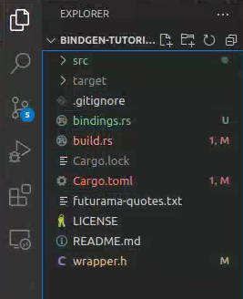
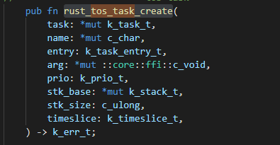
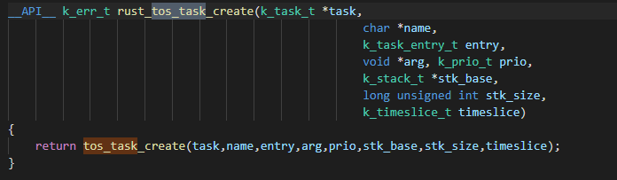
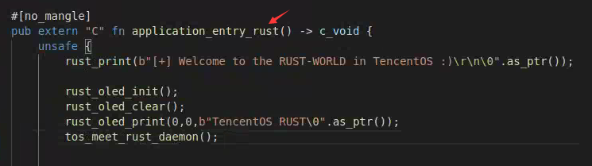
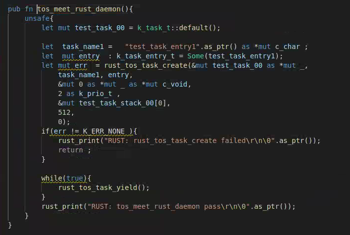
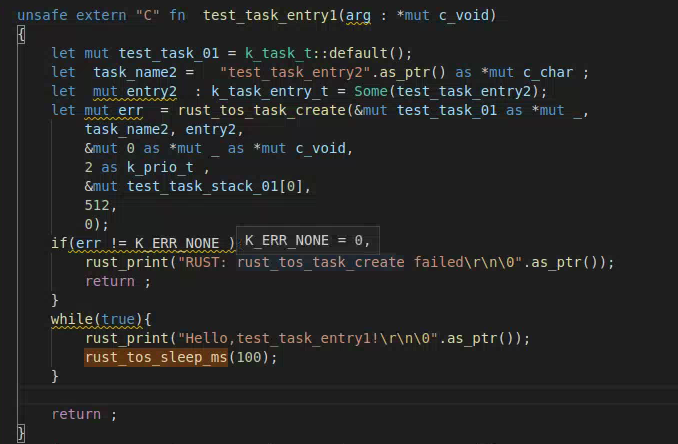
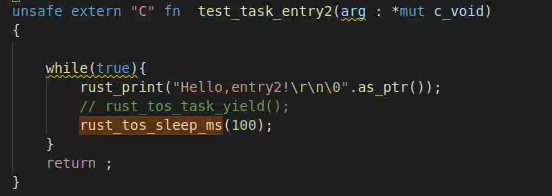
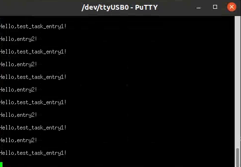

[toc]

#  Tos Meet Rust

> 本项目基于ikey4u在TencentOS Tiny搭建的rust框架上进行实现，主要是对tos的公开的内核接口使用rust进行封装，并且对部分封装好的rust api设计和实现简单的测试。
>
> ikey4u项目原地址：https://github.com/OpenAtomFoundation/TencentOS-tiny/tree/master/examples/tos_meets_rust

## 使用的技术、库等

### Rust ffi

FFI(Foreign Function Interface)是用来与其它语言交互的接口，在有些语言里面称为语言绑定(language bindings)。

FFI 的本质其实是 **参数传递 + 函数调用 + 返回值传递**，而参数传递和返回值传递的方式，都是由 **具体的 ABI 所规定** 的。

ABI（application binary interface）描述了应用程序（或者其他类型）和操作系统之间或其他应用程序的低级接口。

ABI涵盖了各种细节，如：

- 数据类型的大小、布局和对齐;
- 调用约定（控制着函数的参数如何传送以及如何接受返回值），例如，是所有的参数都通过栈传递，还是部分参数通过寄存器传递；哪个寄存器用于哪个函数参数；通过栈传递的第一个函数参数是最先push到栈上还是最后；
- 系统调用的编码和一个应用如何向操作系统进行系统调用；
- 以及在一个完整的操作系统ABI中，目标文件的二进制格式、程序库等等。

**Rust**作为一门**系统**级语言，自带对ffi调用的支持。

### rust bindgen

bindgen自动生成C(和一些c++)库的Rust FFI绑定。bindgen 可以作为一个 crate，与 Cargo 的 build.rs 机制配合。

bindgen的安装教程见https://rust-lang.github.io/rust-bindgen/

实际的使用过程中发现它需要std库的支持，而整个项目使用的是no-std的thumbv6m-none-eabi，没办法在项目中直接生成。因此在实际的过程中是通过一个示例项目替换掉要绑定的数据结构、函数等来生成的。使用的是它支持的命令行模式。由于使用了std库的支持，会不可避免的产生一些使用了std库的变量，这里是手动进行替换。

示例项目可以在上面的安装教程中找到，其目录结构如下：



wrapper.h中存放要转换的c api和数据结构

然后使用命令行命令进行转换，命令如下

```
bindgen wrapper.h -o bindings.rs --use-core --default-enum-style "rust" --with-derive-default
```

生成的文件在bindings.rs文件中，由于使用了std库的支持，会不可避免的产生一些使用了std库的变量，可能需要做些许的修改。然后将对应的数据结构和api放入bridge.rs，在tosglue.c实现对应的入口函数。

例如rust_tos_task_create函数



对应在tosglue.c中的函数



## 项目最终的成果

### 总结

完成了对TencentOS Tiny SDK文档中部分API的封装，例如系统管理的部分函数、任务管理、堆内存管理、块内存管理等API。完成了对部分封装API的测试，例如任务管理、mutex等API的简单使用和测试

有待完善：部分封装函数存在bug，所有的结构存放在bridge.rs,所有函数实现放在lib.rs和tosglue.c，如果可能的话应该将这些接口的结构和函数剥离分别放入多个文件中进行实现。

### 任务切换简单示例

#### 测试函数内容

实现了一个简单的任务切换函数展示了通过rust创建任务以及任务切换的功能。

以下是启动该函数的简单过程：

按照ikey4u的[教程](https://github.com/OpenAtomFoundation/TencentOS-tiny/tree/master/examples/tos_meets_rust)搭建好环境，进入tos_meets_rust目录下之后。

我们首先将tos_meet_rust_daemon函数的注释打开，使用bash build.sh对内核和程序进行编译运行。

首先我们初始化tos完成之后，启动tos之后进入名为application_entry_rust的入口函数，从这里开始进入了rust的世界，如下图所示。



tos_meet_rust_daemo函数就是写好的简单的任务切换函数，该函数的主要过程如下：

1. 首先创建创建task的几个必要变量，比如task对象test_task_00，任务名task_name1，任务函数入口entry指向函数test_task_entry1
2. 调用函数rust_tos_task_create，这里给其优先级为2，比当前任务优先级高1
3. 接下来由于优先级调度的原因，程序进入到test_task_entry1去执行。tos_meet_rust_daemo这里的while循环里调用rust_tos_task_yield放弃cpu防止干扰两个测试任务



如下图，测试任务1负责创建同优先级的测试任务2，这里的参数创建和调用任务创建函数与上面类似，这里不在赘述。创建测试任务2完成之后，测试任务进入一个while循环，打印一条信息然后睡眠自身，此时cpu将由测试任务2接管。



测试函数2如下图所示，与测试任务1的while循环类似打印一条信息然后睡眠自身



预计测试结果是测试任务1和测试任务2交替执行，不断打印两条不同的信息。

#### 测试结果

测试结果如下图所示，可以看到，测试任务1和测试任务2交替执行不断打印两条不同的信息。

测试成功



### 内核API封装和测试情况

封装和测试情况由于统计结果比较多，可以查看[test_case.md](./test_case.md)文件。

