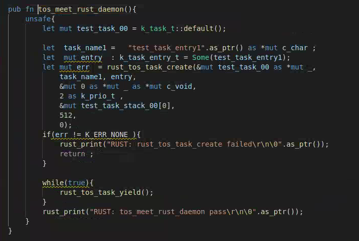
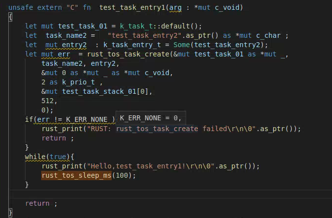
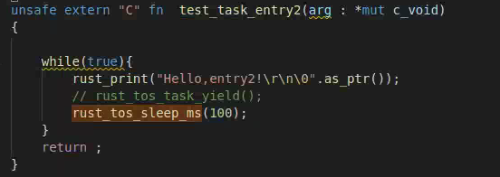
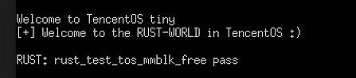

[toc]

#  Tos Meet Rust

> 本项目基于ikey4u在TencentOS Tiny搭建的rust框架上进行实现，主要是对tos的公开的内核接口使用rust进行封装，并且对部分封装好的rust api设计和实现简单的测试。
>

## 使用的技术、库等

### Rust ffi

FFI(Foreign Function Interface)是用来与其它语言交互的接口，在有些语言里面称为语言绑定(language bindings)。

FFI 的本质其实是 **参数传递 + 函数调用 + 返回值传递**，而参数传递和返回值传递的方式，都是由 **具体的 ABI 所规定** 的。

ABI（application binary interface）描述了应用程序（或者其他类型）和操作系统之间或其他应用程序的低级接口。

ABI涵盖了各种细节，如：

- 数据类型的大小、布局和对齐;
- 调用约定（控制着函数的参数如何传送以及如何接受返回值），例如，是所有的参数都通过栈传递，还是部分参数通过寄存器传递；哪个寄存器用于哪个函数参数；通过栈传递的第一个函数参数是最先push到栈上还是最后；
- 系统调用的编码和一个应用如何向操作系统进行系统调用；
- 以及在一个完整的操作系统ABI中，目标文件的二进制格式、程序库等等。

**Rust**作为一门**系统**级语言，自带对ffi调用的支持。

### rust bindgen

bindgen自动生成C(和一些c++)库的Rust FFI绑定。bindgen 可以作为一个 crate，与 Cargo 的 build.rs 机制配合。

bindgen的安装教程见https://rust-lang.github.io/rust-bindgen/

实际的使用过程中发现它需要std库的支持，而整个项目使用的是no-std的thumbv6m-none-eabi，没办法在项目中直接生成。因此在实际的过程中是通过一个示例项目替换掉要绑定的数据结构、函数等来生成的。使用的是它支持的命令行模式。由于使用了std库的支持，会不可避免的产生一些使用了std库的变量，这里是手动进行替换。

示例项目可以在上面的安装教程中找到，其目录结构如下：


wrapper.h中存放要转换的c api和数据结构

然后使用命令行命令进行转换，命令如下

```
bindgen wrapper.h -o bindings.rs --use-core --default-enum-style "rust" --with-derive-default
```

生成的文件在bindings.rs文件中，由于使用了std库的支持，会不可避免的产生一些使用了std库的变量，可能需要做些许的修改。然后将对应的数据结构和api放入bridge.rs，在tosglue.c实现对应的入口函数。

例如rust_tos_task_create函数


对应在tosglue.c中的函数


## 项目最终的成果

### 总结

完成了对TencentOS Tiny SDK文档中部分API的封装，例如系统管理的部分函数、任务管理、堆内存管理、块内存管理等API。完成了对部分封装API的测试，例如任务管理、mutex等API的简单使用和测试

有待完善：部分封装函数存在bug，所有的结构存放在bridge.rs,所有函数实现放在lib.rs和tosglue.c，如果可能的话应该将这些接口的结构和函数剥离分别放入多个文件中进行实现。

具体完成情况见下表

### 任务切换简单示例

#### 测试函数内容

实现了一个简单的任务切换函数展示了通过rust创建任务以及任务切换的功能。

以下是启动该函数的简单过程：

按照ikey4u的教程，进入tos_meets_rust目录下之后，将tos_meet_rust_daemon函数的注释打开，使用bash build.sh对内核和程序进行编译运行。

首先我们初始化tos完成之后，启动tos之后进入名为application_entry_rust的入口函数，从这里开始进入了rust的世界，如下图所示。


tos_meet_rust_daemo函数就是写好的简单的任务切换函数，该函数的主要过程如下：

1. 首先创建创建task的几个必要变量，比如task对象test_task_00，任务名task_name1，任务函数入口entry指向函数test_task_entry1
2. 调用函数rust_tos_task_create，这里给其优先级为2，比当前任务优先级高1
3. 接下来由于优先级调度的原因，程序进入到test_task_entry1去执行。tos_meet_rust_daemo这里的while循环里调用rust_tos_task_yield放弃cpu防止干扰两个测试任务



如下图，测试任务1负责创建同优先级的测试任务2，这里的参数创建和调用任务创建函数与上面类似，这里不在赘述。创建测试任务2完成之后，测试任务进入一个while循环，打印一条信息然后睡眠自身，此时cpu将由测试任务2接管。



测试函数2如下图所示，与测试任务1的while循环类似打印一条信息然后睡眠自身



预计测试结果是测试任务1和测试任务2交替执行，不断打印两条不同的信息。

#### 测试结果

测试结果如下图所示，可以看到，测试任务1和测试任务2交替执行不断打印两条不同的信息。

测试成功


### 内核API封装和测试情况

#### 任务管理

| rust api                          | c api                        |
| --------------------------------- | ---------------------------- |
| rust_tos_task_create              | tos_task_create              |
| rust_tos_task_destroy             | tos_task_destroy             |
| rust_tos_task_create_dyn          | tos_task_create_dyn          |
| rust_tos_task_delay               | tos_task_delay               |
| rust_tos_task_delay_abort         | tos_task_delay_abort         |
| rust_tos_task_suspend             | tos_task_suspend             |
| rust_tos_task_resume              | tos_task_resume              |
| rust_tos_task_prio_change         | tos_task_prio_change         |
| rust_tos_task_yield               | tos_task_yield               |
| rust_tos_task_curr_task_get       | tos_task_curr_task_get       |
| rust_tos_task_stack_draught_depth | tos_task_stack_draught_depth |
| rust_tos_task_walkthru            | tos_task_walkthru            |

##### 测试函数：

###### rust_test_tos_task_create(); 

**测试函数过程：**

测试了与idle任务优先级相等的任务的创建、比idle任务更高优先级的任务的创建、与当前任务优先级相等的任务的创建。如果返回值与预期不符则打印对应的错误信息并且终止程序。

预计结果，只有与当前任务优先级相等的任务将创建成功，只输出“RUST: rust_test_tos_task_create pass”。

 **测试结果：**

测试成功，输出“RUST: rust_test_tos_task_create pass”。


**代码如下：**

```rust
unsafe extern "C" fn  test_task_entry(arg : *mut c_void) 
{
    rust_print("test_task_entry\r\n\0".as_ptr());
    return ;
}
pub fn rust_test_tos_task_create(){
    unsafe{
        let mut test_task_00 = k_task_t::default();
       
        let  task_name =   "test_task".as_ptr() as *mut c_char ;
        let  mut entry  : k_task_entry_t = Some(test_task_entry);


        let mut err  = rust_tos_task_create(&mut test_task_00 as *mut _, 
                                            task_name, entry, 
                                            0 as *mut c_void /*K_NULL*/, 
                                            9 as k_prio_t /*K_TASK_PRIO_IDLE  9*/, 
                                            &mut test_task_stack_00[0], 
                                            512, 
                                            0);

        if(err != K_ERR_TASK_PRIO_INVALID){
            rust_print("RUST: rust_tos_task_create  test idle failed\r\n\0".as_ptr());
            return ;
        }

        err  = rust_tos_task_create(&mut test_task_00 as *mut _, 
                                    task_name, entry, 
                                    0 as *mut c_void /*K_NULL*/, 
                                    10 as k_prio_t /*K_TASK_PRIO_IDLE+1  10*/, 
                                    &mut test_task_stack_00[0], 
                                    512, 
                                    0);
             
        if(err != K_ERR_TASK_PRIO_INVALID){
            rust_print("RUST: rust_tos_task_create out of prio failed\r\n\0".as_ptr());
            return ;
        }

        err  = rust_tos_task_create(&mut test_task_00 as *mut _, 
                                    task_name, entry, 
                                    0 as *mut c_void /*K_NULL*/, 
                                    3 as k_prio_t /*K_TASK_PRIO_IDLE+1  10*/, 
                                    &mut test_task_stack_00[0], 
                                    512, 
                                    0);               
        if(err != K_ERR_NONE){
            rust_print("RUST: rust_tos_task_create create failed\r\n\0".as_ptr());
            return ;
        }

        err = rust_tos_task_destroy(&mut test_task_00 as *mut _);
        if(err != K_ERR_NONE){
            rust_print("RUST: rust_tos_task_destroy  failed\r\n\0".as_ptr());
            return ;
        }

        rust_print("RUST: rust_test_tos_task_create pass\r\n\0".as_ptr());
    }
}
```


###### rust_test_tos_task_destroy();

**测试函数过程：**

首先测试销毁idle任务，然后正常创建一个与当前优先级相同的任务，然后销毁。如果任务销毁函数返回值不对则打印错误信息并且终止函数。

预计结果： 创建好的与当前优先级相同的任务成功销毁，输出“RUST: rust_test_tos_task_destroy pass”

 **测试结果：**


**代码如下**

```rust
pub fn rust_test_tos_task_destroy(){
    unsafe{
        let mut err = rust_tos_task_destroy(&mut k_idle_task as *mut _);
        if(err != K_ERR_TASK_DESTROY_IDLE){
            rust_print("RUST: rust_tos_task_destroy  test idle failed\r\n\0".as_ptr());
            return ;
        }
        let mut test_task_00 = k_task_t::default();
       
        let  task_name =   "test_task".as_ptr() as *mut c_char ;
        let  mut entry  : k_task_entry_t = Some(test_task_entry);

        err  = rust_tos_task_create(&mut test_task_00 as *mut _, 
            task_name, entry, 
            0 as *mut c_void /*K_NULL*/, 
            3 as k_prio_t /*K_TASK_PRIO_IDLE+1  10*/, 
            &mut test_task_stack_00[0], 
            512, 
            0);
                          
        if(err != K_ERR_NONE){
            rust_print("RUST: rust_tos_task_create create failed\r\n\0".as_ptr());
            return ;
        }

        err = rust_tos_task_destroy(&mut test_task_00 as *mut _);
        if(err != K_ERR_NONE){
            rust_print("RUST: rust_tos_task_destroy test_task_00 failed\r\n\0".as_ptr());
            return ;
        }

        rust_print("RUST: rust_test_tos_task_destroy pass\r\n\0".as_ptr()); 
    }
}
```

###### rust_test_tos_task_delay();

**测试函数过程：**

首先获取当前系统时间tick数，调用rust_test_tos_task_delay函数delay当前任务2000ticks，然后再次获取系统tick数，比较delay时间是否为2000ticks

预计结果，delay时间是2000ticks

**测试结果：**

测试成功，delay时间是2000ticks


**代码如下：**

```rust
pub fn rust_test_tos_task_delay(){

    unsafe{
        // let mut count = 0;
        let mut begin: k_tick_t = 10;
        let mut end: k_tick_t = 10;
        let mut delay:*mut k_tick_t = 2000 as *mut k_tick_t;
        let mut deviation: k_tick_t = 10;
        
        begin = rust_tos_systick_get();
        let err = rust_tos_task_delay(delay);
        if(err != K_ERR_NONE){
            rust_print("RUST: rust_tos_task_delay failed\r\n\0".as_ptr());
            return ;
        }
        end = rust_tos_systick_get();
        rust_print_num(begin);
        rust_print_num(end);
        rust_print("RUST: rust_test_tos_task_delay pass\r\n\0".as_ptr());
    }
}
```

###### rust_test_tos_task_suspend_resume();

**测试函数过程：**

创建一个比当前任务优先级低的任务，该任务只有一个打印语句。在当前任务挂起新建的任务，执行rust_tos_task_resume函数前delay当前任务，此时由于新建任务被挂起无法执行。然后执行rust_tos_task_resume函数并且再次delay当前任务，新建任务恢复调度且当前任务delay，新建任务可以执行打印。

预测结果，执行rust_tos_task_resume函数之前新建任务不打印，执行rust_tos_task_resume函数之后新建任务执行打印，最后返回测试函数输出“RUST: rust_test_tos_task_suspend_resume pass”

**测试结果：**


**代码如下：**

```rust
unsafe extern "C" fn  test_tos_task_suspend_resume_entry(arg : *mut c_void) 
{

    rust_print("test_task_entry\r\n\0".as_ptr());
    return ;
}
pub fn rust_test_tos_task_suspend_resume(){
    unsafe{
        let mut test_task_00 = k_task_t::default();
       
        let  task_name =   "test_task".as_ptr() as *mut c_char ;
        let  mut entry  : k_task_entry_t = Some(test_tos_task_suspend_resume_entry);
    
        let mut err  = rust_tos_task_create(&mut test_task_00 as *mut _, 
            task_name, entry, 
            0 as *mut c_void , 
            4 as k_prio_t /*K_TASK_PRIO_IDLE  9*/, 
            &mut test_task_stack_00[0], 
            512, 
            0);  
        if(err != K_ERR_NONE){
            rust_print("RUST: rust_tos_task_create  test delay abort failed\r\n\0".as_ptr());
            return ;
        }

        err = rust_tos_task_suspend(&mut test_task_00 as *mut _);
       
        if(err != K_ERR_NONE){
            rust_print("RUST: rust_tos_task_suspend failed\r\n\0".as_ptr());
            return ;
        }

        rust_print("RUST: before rust_tos_task_resume,task delay\r\n\0".as_ptr());
        let delay_1 : k_time_t = 1000;
        rust_tos_task_delay(rust_tos_millisec2tick(delay_1) as *mut k_tick_t);
        

        
        err = rust_tos_task_resume(&mut test_task_00 as *mut _);
        rust_print("RUST: after rust_tos_task_resume,task delay \r\n\0".as_ptr());
        rust_tos_task_delay(rust_tos_millisec2tick(delay_1) as *mut k_tick_t);
        
        

        err = rust_tos_task_destroy(&mut test_task_00 as *mut _);
        if(err != K_ERR_NONE){
            rust_print("RUST: rust_tos_task_destroy failed\r\n\0".as_ptr());
            return ;
        }
        rust_print("RUST: rust_test_tos_task_suspend_resume pass\r\n\0".as_ptr());
    }
 
}
```

###### rust_test_tos_task_prio_change();

**测试函数过程：**

测试函数创建优先级为4的任务，然后尝试修改其优先级分别为idle任务等同的优先级、当前优先级4、比当前任务优先级更高的优先级2，分别测试修改优先级函数执行之后新建的任务优先级是否修改为指定优先级，如果不是则输出错误信息并且退出。

预计结果：修改优先级成功，测试函数只输出一次创建任务的打印和“RUST: rust_test_tos_task_prio_change pass”

**测试结果：**


**代码如下：**

```rust
pub fn rust_test_tos_task_prio_change(){
    unsafe{
        let mut test_task_00 = k_task_t::default();
       
        let  task_name =   "test_task".as_ptr() as *mut c_char ;
        let  mut entry  : k_task_entry_t = Some(test_task_entry);
    
        let mut err  = rust_tos_task_create(&mut test_task_00 as *mut _, 
            task_name, entry, 
            0 as *mut c_void , 
            4 as k_prio_t /*K_TASK_PRIO_IDLE  9*/, 
            &mut test_task_stack_00[0], 
            512, 
            0);  
        
        err = rust_tos_task_prio_change(&mut test_task_00 as *mut _,  9 as k_prio_t);
        if(err != K_ERR_TASK_PRIO_INVALID){
            rust_print("RUST: rust_tos_task_prio_change to idle  test failed\r\n\0".as_ptr());
            return ;
        }

        err = rust_tos_task_prio_change(&mut test_task_00 as *mut _,  4 as k_prio_t);
        if(test_task_00.prio != (4 as k_prio_t)){
            rust_print("RUST: rust_tos_task_prio_change  failed\r\n\0".as_ptr());
            return ;
        }

        err = rust_tos_task_prio_change(&mut test_task_00 as *mut _,  2 as k_prio_t);
        if(test_task_00.prio != (2 as k_prio_t)){
            rust_print("RUST: rust_tos_task_prio_change  failed\r\n\0".as_ptr());
            return ;
        }

        err = rust_tos_task_destroy(&mut test_task_00 as *mut _);
        if(err != K_ERR_NONE){
            rust_print("RUST: rust_tos_task_destroy failed\r\n\0".as_ptr());
            return ;
        }
        rust_print("RUST: rust_test_tos_task_prio_change pass\r\n\0".as_ptr());
    }
}
```

###### rust_test_tos_task_yeild();

**测试函数过程：**

测试过程与任务切换示例基本一致，只将delay换成了yeild

**测试结果：**


**代码如下：**

```rust

unsafe extern "C" fn  test_tos_task_yeild_entry1(arg : *mut c_void) 
{
    let mut test_task_01 = k_task_t::default();
    let  task_name2 =   "test_tos_task_yeild_entry2".as_ptr() as *mut c_char ;
    let  mut entry2  : k_task_entry_t = Some(test_tos_task_yeild_entry2);
    let mut err  = rust_tos_task_create(&mut test_task_01 as *mut _, 
        task_name2, entry2, 
        &mut 0 as *mut _ as *mut c_void, 
        2 as k_prio_t , 
        &mut test_task_stack_01[0], 
        512, 
        0);
    if(err != K_ERR_NONE ){
        rust_print("RUST: rust_tos_task_create failed\r\n\0".as_ptr());
        return ;
    }
    while(true){
        rust_print("Hello,test_task_entry1!\r\n\0".as_ptr());
        // rust_tos_sleep_ms(100);
        rust_tos_task_yield();
    }
    
    return ;
}
unsafe extern "C" fn  test_tos_task_yeild_entry2(arg : *mut c_void) 
{

    while(true){
        rust_print("Hello,entry2!\r\n\0".as_ptr());
        rust_tos_task_yield();
        // rust_tos_sleep_ms(100);
    }
    return ;
}
pub fn rust_test_tos_task_yeild(){
    unsafe{
        let mut test_task_00 = k_task_t::default();
        
        let  task_name1 =   "test_tos_task_yeild_entry1".as_ptr() as *mut c_char ;
        let  mut entry  : k_task_entry_t = Some(test_tos_task_yeild_entry1);
        let mut err  = rust_tos_task_create(&mut test_task_00 as *mut _, 
            task_name1, entry, 
            &mut 0 as *mut _ as *mut c_void, 
            2 as k_prio_t , 
            &mut test_task_stack_00[0], 
            512, 
            0);
        if(err != K_ERR_NONE ){
            rust_print("RUST: rust_tos_task_create failed\r\n\0".as_ptr());
            return ;
        }

        while(true){
            rust_tos_task_yield();
        }
        rust_print("RUST: rust_test_tos_task_yeild pass\r\n\0".as_ptr());
    }
}
```

#### 块内存管理

| rust api                    | c api                  |
| --------------------------- | ---------------------- |
| rust_tos_mmblk_pool_create  | tos_mmblk_pool_create  |
| rust_tos_mmblk_pool_destroy | tos_mmblk_pool_destroy |
| rust_tos_mmblk_alloc        | tos_mmblk_alloc        |
| rust_tos_mmblk_free         | tos_mmblk_free         |

##### 测试函数

###### rust_test_tos_mmblk_pool_create();

**测试过程：**

测试创建设置正确的参数创建三个mmblk，然后销毁，测试创建buffer为null的mmblk，测试创建错误blk_size的mmblk。检测各个函数的返回值，如果返回值不正确则输出错误信息并且退出。

预计结果，成功通过测试，仅输出“RUST: rust_test_tos_mmblk_pool_create pass”

**测试结果：**


**代码如下：**

```rust
static mut mmblk_pool_buffer_00 : [u8; (5*0x20)] = [0;(5*0x20)];
static mut mmblk_pool_buffer_01 : [u8; (5*0x20)] = [0;(5*0x20)];
static mut mmblk_pool_buffer_02 : [u8; (5*0x20)] = [0;(5*0x20)];

pub fn rust_test_tos_mmblk_pool_create(){
    unsafe{
        let mut test_mmblk_pool_00 = k_mmblk_pool_t::default() ;
        let mut test_mmblk_pool_01 = k_mmblk_pool_t::default() ;
        let mut test_mmblk_pool_02 = k_mmblk_pool_t::default() ;

        let mut err = rust_tos_mmblk_pool_create(&mut test_mmblk_pool_00 as *mut _, &mut mmblk_pool_buffer_00 as *mut _ as *mut c_void, 5, 32);
        if(err != K_ERR_NONE){
            rust_print("RUST: rust_tos_mmblk_pool_create failed\r\n\0".as_ptr());
            return ;
        }

        err = rust_tos_mmblk_pool_create(&mut test_mmblk_pool_01 as *mut _, &mut mmblk_pool_buffer_01 as *mut _ as *mut c_void, 5, 32);
        if(err != K_ERR_NONE){
            rust_print("RUST: rust_tos_mmblk_pool_create failed\r\n\0".as_ptr());
            return ;
        }

        err = rust_tos_mmblk_pool_create(&mut test_mmblk_pool_02 as *mut _, &mut mmblk_pool_buffer_02 as *mut _ as *mut c_void, 5, 32);
        if(err != K_ERR_NONE){
            rust_print("RUST: rust_tos_mmblk_pool_create failed\r\n\0".as_ptr());
            return ;
        }

        err = rust_tos_mmblk_pool_destroy(&mut test_mmblk_pool_00);
        if(err != K_ERR_NONE){
            rust_print("RUST: rust_tos_mmblk_pool_destroy failed\r\n\0".as_ptr());
            return ;
        }

        err = rust_tos_mmblk_pool_destroy(&mut test_mmblk_pool_01);
        if(err != K_ERR_NONE){
            rust_print("RUST: rust_tos_mmblk_pool_destroy failed\r\n\0".as_ptr());
            return ;
        }

        err = rust_tos_mmblk_pool_destroy(&mut test_mmblk_pool_02);
        if(err != K_ERR_NONE){
            rust_print("RUST: rust_tos_mmblk_pool_destroy failed\r\n\0".as_ptr());
            return ;
        }

        err = rust_tos_mmblk_pool_create(&mut test_mmblk_pool_00 as *mut _, 0 as *mut c_void, 5, 32);
        if(err != K_ERR_OBJ_PTR_NULL){
            rust_print("RUST: rust_tos_mmblk_pool_create 0 failed\r\n\0".as_ptr());
            return ;
        }

        err = rust_tos_mmblk_pool_create(&mut test_mmblk_pool_01 as *mut _, &mut mmblk_pool_buffer_01 as *mut _ as *mut c_void, 5, 33);
        if(err != K_ERR_MMBLK_INVALID_BLK_SIZE){
            rust_print("RUST: rust_tos_mmblk_pool_create size failed\r\n\0".as_ptr());
            return ;
        }

        rust_print("RUST: rust_test_tos_mmblk_pool_create pass\r\n\0".as_ptr());
    }

}
```

######  rust_test_tos_mmblk_pool_destroy();

**测试过程：**

测试销毁null mmblk对象，如果返回值不正确则输出错误信息并且退出。

预计结果，成功通过测试，仅输出“RUST: rust_test_tos_mmblk_pool_destroy pass”

**测试结果：**


**代码如下：**

```rust
pub fn rust_test_tos_mmblk_pool_destroy(){
    let mut  test_mmblk_pool_00 :  *mut *mut k_mmblk_pool_t = &mut 0 as *mut _ as *mut *mut k_mmblk_pool_t;
    unsafe{
        let mut err = rust_tos_mmblk_pool_destroy(*test_mmblk_pool_00);
        if (  err != K_ERR_OBJ_PTR_NULL ) {
            rust_print("RUST: rust_tos_mmblk_pool_destroy  failed\r\n\0".as_ptr());
            return ;
        }
        rust_print("RUST: rust_test_tos_mmblk_pool_destroy pass\r\n\0".as_ptr());
    }
}
```

######  rust_test_tos_mmblk_alloc();

**测试过程：**

测试mmblk的分配，首先创建一个mmblk pool，size是5。调用rust_tos_mmblk_alloc分配五次，如果分配未成功或者返回的blk指针值为空则输出错误信息，退出。再次调用rust_tos_mmblk_alloc分配，如果返回值不为K_ERR_MMBLK_POOL_EMPTY则输出错误信息，退出。

预计结果，成功通过测试，仅输出“RUST: rust_test_tos_mmblk_alloc pass”

**测试结果：**


**代码如下：**

```rust
pub fn rust_test_tos_mmblk_alloc(){
    unsafe{
        let mut test_mmblk_pool_00 = k_mmblk_pool_t::default();
        let mut err = rust_tos_mmblk_pool_create(&mut test_mmblk_pool_00 as *mut _, &mut mmblk_pool_buffer_00 as *mut _ as *mut c_void, 5, 32);
        if(err != K_ERR_NONE){
            rust_print("RUST: rust_tos_mmblk_pool_create failed\r\n\0".as_ptr());
            return ;
        }
        let mut blk = test_mmblk_pool_00.free_list;
        let pblk = &mut blk as *mut *mut c_void;
        for i in 1..6  {
            err = rust_tos_mmblk_alloc(&mut test_mmblk_pool_00 as *mut _, pblk);
            if(err != K_ERR_NONE){
                rust_print("RUST: rust_tos_mmblk_alloc failed\r\n\0".as_ptr());
                return ;
            }
            if(pblk == (0 as * mut  *mut c_void)){
                rust_print("RUST: blk ==null failed\r\n\0".as_ptr());
                return ;
            }
            
        }
        err = rust_tos_mmblk_alloc(&mut test_mmblk_pool_00 as *mut _, 0 as * mut  *mut c_void);
        if(err != K_ERR_MMBLK_POOL_EMPTY){
            rust_print("RUST: rust_tos_mmblk_alloc empty\r\n\0".as_ptr());
            return ;
        }

        err =rust_tos_mmblk_pool_destroy(&mut test_mmblk_pool_00 as *mut _);
        if(err != K_ERR_NONE){
            rust_print("RUST: rust_tos_mmblk_pool_destroy failed\r\n\0".as_ptr());
            return ;
        }
        rust_print("RUST: rust_test_tos_mmblk_alloc pass\r\n\0".as_ptr());
    }
}
```

######  rust_test_tos_mmblk_free();

**测试过程：**

测试mmblk的释放，首先创建一个mmblk pool，分配一次，然后调用rust_tos_mmblk_free释放一个内存块，然后再次调用rust_tos_mmblk_free释放一个内存块，第一次成功释放，第二次则是由于内存池已满会释放失败。测试返回值是否正确，如果不正确则输出错误信息，退出。

预计结果，成功通过测试，仅输出“RUST: rust_test_tos_mmblk_free pass”

**测试结果：**



**代码如下：**

```rust
pub fn rust_test_tos_mmblk_free(){
    unsafe{
        let mut test_mmblk_pool_00 = k_mmblk_pool_t::default();
        let mut err = rust_tos_mmblk_pool_create(&mut test_mmblk_pool_00 as *mut _,&mut  mmblk_pool_buffer_00 as *mut _ as *mut c_void, 5, 32);
        if(err != K_ERR_NONE){
            rust_print("RUST: rust_tos_mmblk_pool_create failed\r\n\0".as_ptr());
            return ;
        }

        let mut blk = test_mmblk_pool_00.free_list;
        let pblk = &mut blk as *mut *mut c_void;
        err = rust_tos_mmblk_alloc(&mut test_mmblk_pool_00 as *mut _, pblk);
        if(err != K_ERR_NONE){
            rust_print("RUST: rust_tos_mmblk_alloc failed\r\n\0".as_ptr());
            return ;
        }
        if(pblk == (0 as * mut  *mut c_void)){
            rust_print("RUST: blk ==null failed\r\n\0".as_ptr());
            return ;
        }

        err = rust_tos_mmblk_free(&mut test_mmblk_pool_00 as *mut _, blk);
        if(err != K_ERR_NONE){
            rust_print("RUST: rust_tos_mmblk_alloc failed\r\n\0".as_ptr());
            return ;
        }

        err = rust_tos_mmblk_free(&mut test_mmblk_pool_00 as *mut _, blk);
        if(err != K_ERR_MMBLK_POOL_FULL){
            rust_print("RUST: rust_tos_mmblk_alloc free failed\r\n\0".as_ptr());
            return ;
        }

        err =rust_tos_mmblk_pool_destroy(&mut test_mmblk_pool_00 as *mut _);
        if(err != K_ERR_NONE){
            rust_print("RUST: rust_tos_mmblk_pool_destroy failed\r\n\0".as_ptr());
            return ;
        }
        rust_print("RUST: rust_test_tos_mmblk_free pass\r\n\0".as_ptr());
    }
}
```

#### 互斥量mutex

| rust api                  | c api                |
| ------------------------- | -------------------- |
| rust_tos_mutex_create     | tos_mutex_create     |
| rust_tos_mutex_create_dyn | tos_mutex_create_dyn |
| rust_tos_mutex_destroy    | tos_mutex_destroy    |
| rust_tos_mutex_pend_timed | tos_mutex_pend_timed |
| rust_tos_mutex_pend       | tos_mutex_pend       |
| rust_tos_mutex_post       | tos_mutex_post       |
| rust_mutex_release        | mutex_release        |

##### 测试函数

###### rust_test_tos_mutex_create();

**测试过程：**

测试rust_tos_mutex_create的创建和销毁，简单的设置参数和调用，测试返回值是否正确

预计结果：返回值正确，仅输出"RUST: rust_test_tos_mutex_create pass"

**测试结果：**


**代码如下：**

```rust
pub fn rust_test_tos_mutex_create(){
    unsafe{
        let mut  test_mutex_00 :  k_mutex_t = k_mutex_t::default();
        let mut err = rust_tos_mutex_create(&mut test_mutex_00 as *mut _);
        if(err != K_ERR_NONE){
            rust_print("RUST: rust_tos_mutex_create failed\r\n\0".as_ptr());
            return ;
        }

        err = rust_tos_mutex_destroy(&mut test_mutex_00 as *mut _);
        if(err != K_ERR_NONE){
            rust_print("RUST: rust_tos_mutex_destroy failed\r\n\0".as_ptr());
            return ;
        }
        rust_print("RUST: rust_test_tos_mutex_create pass\r\n\0".as_ptr());
    }
}

```

###### rust_test_tos_mutex_create_dyn();

**测试过程：**

测试rust_tos_mutex_create_dyn的创建和销毁，简单的设置参数和调用,测试返回值是否正确

预计结果：返回值正确，仅输出"RUST: rust_test_tos_mutex_create_dyn pass"

**测试结果：**


**代码如下：**

```rust
pub fn rust_test_tos_mutex_create_dyn(){
    unsafe{
        let mut  test_mutex_00 :  k_mutex_t = k_mutex_t::default();
        let mut  test_mutex_00_dyn :  *mut *mut k_mutex_t = &mut test_mutex_00 as *mut _ as *mut *mut k_mutex_t;
        let mut err = rust_tos_mutex_create_dyn(test_mutex_00_dyn);
        if(err != K_ERR_NONE){
            rust_print("RUST: rust_tos_mutex_create_dyn failed\r\n\0".as_ptr());
            return ;
        }

        err = rust_tos_mutex_destroy(*test_mutex_00_dyn);
        if(err != K_ERR_NONE){
            rust_print("RUST: rust_tos_mutex_destroy failed\r\n\0".as_ptr());
            return ;
        }
        rust_print("RUST: rust_test_tos_mutex_create_dyn pass\r\n\0".as_ptr());
    }
}
```

###### rust_test_tos_mutex_destroy(); 

**测试过程：**

测试rust_tos_mutex_destroy销毁null对象，测试返回值是否正确

预计结果：返回值正确，仅输出"RUST: rust_test_tos_mutex_destroy pass"

**测试结果：**


**代码如下：**

```rust

pub fn rust_test_tos_mutex_destroy(){
    unsafe{
        let mut  test_mutex_destroy :  *mut *mut k_mutex_t = &mut 0 as *mut _ as *mut *mut k_mutex_t;
        let err = rust_tos_mutex_destroy(*test_mutex_destroy);
        if(err != K_ERR_OBJ_PTR_NULL){
            rust_print("RUST: rust_tos_mutex_destroy failed\r\n\0".as_ptr());
            return ;
        }
        rust_print("RUST: rust_test_tos_mutex_destroy pass\r\n\0".as_ptr());
    }
}
```

###### rust_test_tos_mutex_pend();

**测试过程：**

测试rust_tos_mutex_pend,rust_test_tos_mutex_pend函数中首先创建一个mutex,然后调用rust_tos_mutex_pend获取这个mutex，创建一个优先级与当前任务等同的新任务，睡眠当前任务切换到新任务。新任务尝试获取之前的mutex，由于该mutex被rust_test_tos_mutex_pend任务持有，故新任务被挂起，切换回rust_test_tos_mutex_pend任务调用rust_tos_mutex_post释放mutex，再次挂起rust_test_tos_mutex_pend任务，新任务获取mutex之后打印一条语句释放mutex挂起自身，返回rust_test_tos_mutex_pend任务销毁mutex和新任务。

预计结果：rust_tos_mutex_pend功能正常，rust_test_tos_mutex_pend任务释放mutex新建任务被挂起，释放之后新建任务执行打印语句，最后还会输出"RUST: rust_test_tos_mutex_pend pass "

**测试结果：**


**代码如下：**

```rust
unsafe extern "C" fn  test_mutex_pend_task_entry(arg : *mut c_void) 
{
    let mut mutex = arg as *mut _ as *mut k_mutex_t;
    let mut err = rust_tos_mutex_pend(mutex);
    if(err != K_ERR_NONE){
        rust_print("RUST: rust_tos_mutex_pend failed\r\n\0".as_ptr());
        return ;
    }
    rust_print("test_task_entry\r\n\0".as_ptr());
    err = rust_tos_mutex_post(mutex);
    if(err != K_ERR_NONE){
        rust_print("RUST: rust_tos_mutex_post failed\r\n\0".as_ptr());
        return ;
    }
    rust_tos_sleep_ms(1000);
    return ;
}
pub fn rust_test_tos_mutex_pend(){
    unsafe{
        let mut  test_mutex_00 :  k_mutex_t = k_mutex_t::default();
        let mut err = rust_tos_mutex_create(&mut test_mutex_00 as *mut _);
        if(err != K_ERR_NONE){
            rust_print("RUST: rust_tos_mutex_create failed\r\n\0".as_ptr());
            return ;
        }

        err = rust_tos_mutex_pend(&mut test_mutex_00 as *mut _);
        if(err != K_ERR_NONE){
            rust_print("RUST: rust_tos_mutex_pend failed\r\n\0".as_ptr());
            return ;
        }

        rust_print("RUST: sleep before post \r\n\0".as_ptr());
        let mut test_task_00 = k_task_t::default();
        let  task_name =   "test_mutex_pend_task".as_ptr() as *mut c_char ;
        let  mut entry  : k_task_entry_t = Some(test_mutex_pend_task_entry);
        err  = rust_tos_task_create(&mut test_task_00 as *mut _, 
            task_name, entry, 
            &mut test_mutex_00 as *mut _ as *mut c_void, 
            3 as k_prio_t , 
            &mut test_task_stack_00[0], 
            512, 
            0);
        rust_tos_sleep_ms(1000);
        
        
        rust_print("RUST: sleep after  post \r\n\0".as_ptr());   
        err = rust_tos_mutex_post(&mut test_mutex_00 as *mut _);
        if(err != K_ERR_NONE){
            rust_print("RUST: rust_tos_mutex_post failed\r\n\0".as_ptr());
            return ;
        }

        rust_tos_sleep_ms(1000);
        

        err = rust_tos_mutex_destroy(&mut test_mutex_00 as *mut _);
        err = rust_tos_task_destroy(&mut test_task_00 as *mut _);
        rust_print("RUST: rust_test_tos_mutex_pend pass \r\n\0".as_ptr());        
    }
}
```

###### rust_test_tos_mutex_pend_timed();

**测试过程：**

测试rust_tos_mutex_pend_timed。rust_test_tos_mutex_pend_timed测试函数首先创建一个mutex然后获取它，之后创建优先级更高的test_mutex_pend_timed_task_entry任务，切换到该任务运行，test_mutex_pend_timed_task_entry调用rust_tos_mutex_pend_timed函数，等待时间为100ticks。然后切换到rust_test_tos_mutex_pend_timed执行，rust_test_tos_mutex_pend_timed打印当前任务优先级此时应该和test_mutex_pend_timed_task_entry任务优先级一致，等待2000ticks之后post该mutex。

预测结果：rust_test_tos_mutex_pend_timed打印优先级为2，并且在等待2000ticks期间test_mutex_pend_timed_task_entry任务rust_tos_mutex_pend_timed等待时间到，测试其返回值应该与K_ERR_PEND_TIMEOUT一致，打印信息返回。rust_test_tos_mutex_pend_timed再次打印优先级，此时优先级恢复到原来的3。最后输出“RUST: rust_test_tos_mutex_pend_timed pass”

**测试结果：**


**代码如下：**

```rust
unsafe extern "C" fn  test_mutex_pend_timed_task_entry(arg : *mut c_void) 
{
    let mut mutex = arg as *mut _ as *mut k_mutex_t;
    let pend_time :*mut  k_tick_t = 100 as *mut  k_tick_t;

    let mut err = rust_tos_mutex_pend_timed(mutex,pend_time);
    
    if (err == K_ERR_PEND_TIMEOUT){
        rust_print("RUST: rust_tos_mutex_pend_timed return K_ERR_PEND_TIMEOUT\r\n\0".as_ptr());
        return ;
    }

    rust_print("test_task_entry\r\n\0".as_ptr());
  
    rust_tos_sleep_ms(1000);
    return ;
}
pub fn rust_test_tos_mutex_pend_timed(){
    unsafe{
        let mut  test_mutex_00 :  k_mutex_t = k_mutex_t::default();
        let mut err = rust_tos_mutex_create(&mut test_mutex_00 as *mut _);
        if(err != K_ERR_NONE){
            rust_print("RUST: rust_tos_mutex_create failed\r\n\0".as_ptr());
            return ;
        }

        err = rust_tos_mutex_pend(&mut test_mutex_00 as *mut _);
        if(err != K_ERR_NONE){
            rust_print("RUST: rust_tos_mutex_pend failed\r\n\0".as_ptr());
            return ;
        }

        
        let mut test_task_00 = k_task_t::default();
        let  task_name =   "test_mutex_pend_timed_task_entry".as_ptr() as *mut c_char ;
        let  mut entry  : k_task_entry_t = Some(test_mutex_pend_timed_task_entry);
        let mut err  = rust_tos_task_create(&mut test_task_00 as *mut _, 
            task_name, entry, 
            &mut test_mutex_00 as *mut _ as *mut c_void, 
            2 as k_prio_t , 
            &mut test_task_stack_00[0], 
            512, 
            0);
        

        rust_print_num((*k_curr_task).prio as u32);
        let mut delay_ticks :  k_tick_t = 2000u32;
        rust_print("RUST: before  delay\r\n\0".as_ptr());
        rust_tos_sleep_ms(rust_tos_tick2millisec(delay_ticks));
        rust_print("RUST: after  2000 ticks\r\n\0".as_ptr());
        
        
        err = rust_tos_mutex_post(&mut test_mutex_00 as *mut _);
        if(err != K_ERR_NONE){
            rust_print("RUST: rust_tos_mutex_post failed\r\n\0".as_ptr());
            return ;
        }
        rust_print_num((*k_curr_task).prio as u32);

     
        rust_print("RUST: rust_test_tos_mutex_pend_timed pass\r\n\0".as_ptr());
    }
}
```

###### rust_test_tos_mutex_post();

**测试过程：**

测试rust_tos_mutex_post。测试函数创建一个mutex，然后获取这个mutex，接着调用rust_tos_mutex_post释放两次，第一次成功，第二次由于并非是其owner所以返回一个对应的值K_ERR_MUTEX_NOT_OWNER。

预计结果，测试通过，仅输出“RUST: rust_test_tos_mutex_post pass”

**测试结果：**


**代码如下：**

```rust
pub fn rust_test_tos_mutex_post(){
    unsafe{
        let mut  test_mutex_00 :  k_mutex_t = k_mutex_t::default();
        let mut err = rust_tos_mutex_create(&mut test_mutex_00 as *mut _);
        if(err != K_ERR_NONE){
            rust_print("RUST: rust_tos_mutex_create failed\r\n\0".as_ptr());
            return ;
        }

        err = rust_tos_mutex_pend(&mut test_mutex_00 as *mut _);
        if(err != K_ERR_NONE){
            rust_print("RUST: rust_tos_mutex_pend failed\r\n\0".as_ptr());
            return ;
        }

        err = rust_tos_mutex_post(&mut test_mutex_00 as *mut _);
        if(err != K_ERR_NONE){
            rust_print("RUST: rust_tos_mutex_post failed\r\n\0".as_ptr());
            return ;
        }

        err = rust_tos_mutex_post(&mut test_mutex_00 as *mut _);
        if(err != K_ERR_MUTEX_NOT_OWNER){
            rust_print("RUST: rust_tos_mutex_post failed\r\n\0".as_ptr());
            return ;
        }

        err = rust_tos_mutex_destroy(&mut test_mutex_00 as *mut _);
        if(err != K_ERR_NONE){
            rust_print("RUST: rust_tos_mutex_destroy failed\r\n\0".as_ptr());
            return ;
        }

        rust_print("RUST: rust_test_tos_mutex_post pass\r\n\0".as_ptr());
    }
}
```

#### 信号量sem

| rust api                    | c api                  |
| --------------------------- | ---------------------- |
| rust_tos_sem_create_max     | tos_sem_create_max     |
| rust_tos_sem_create         | tos_sem_create         |
| rust_tos_sem_create_max_dyn | tos_sem_create_max_dyn |
| rust_tos_sem_create_dyn     | tos_sem_create_dyn     |
| rust_tos_sem_destroy        | tos_sem_destroy        |
| rust_tos_sem_pend           | tos_sem_pend           |
| rust_tos_sem_post           | tos_sem_post           |
| rust_tos_sem_post_all       | tos_sem_post_all       |

##### 测试函数

###### rust_test_tos_sem_create();

**测试过程：**

测试函数创建不同count的信号量，然后销毁，测试对应的返回值

预计结果：返回值一致，最后输出“RUST: rust_test_tos_sem_create pass”

**测试结果：**


**代码如下：**

```rust
pub fn rust_test_tos_sem_create(){
    unsafe{
        let mut test_sem_00 : k_sem_t = k_sem_t::default();
        let mut test_sem_01 : k_sem_t = k_sem_t::default();
        let mut test_sem_02 : k_sem_t = k_sem_t::default();
        let mut sem_cnt : k_sem_cnt_t = 0u16;
        let mut err = rust_tos_sem_create(&mut test_sem_00 as *mut _,sem_cnt);
        if(err != K_ERR_NONE){
            rust_print("RUST: rust_tos_sem_create 00 failed\r\n\0".as_ptr());
            return ;
        }

        sem_cnt = 255u16;
        let mut err = rust_tos_sem_create(&mut test_sem_01 as *mut _,sem_cnt);
        if(err != K_ERR_NONE){
            rust_print("RUST: rust_tos_sem_create 01 failed\r\n\0".as_ptr());
            return ;
        }

        sem_cnt = 65535u16;
        let mut err = rust_tos_sem_create(&mut test_sem_02 as *mut _,sem_cnt);
        if(err != K_ERR_NONE){
            rust_print("RUST: rust_tos_sem_create 02 failed\r\n\0".as_ptr());
            return ;
        }
        
        let mut err = rust_tos_sem_destroy(&mut test_sem_00 as *mut _);
        if(err != K_ERR_NONE){
            rust_print("RUST: rust_tos_sem_destroy failed\r\n\0".as_ptr());
            return ;
        }

        let mut err = rust_tos_sem_destroy(&mut test_sem_01 as *mut _);
        if(err != K_ERR_NONE){
            rust_print("RUST: rust_tos_sem_destroy failed\r\n\0".as_ptr());
            return ;
        }

        let mut err = rust_tos_sem_destroy(&mut test_sem_02 as *mut _);
        if(err != K_ERR_NONE){
            rust_print("RUST: rust_tos_sem_destroy failed\r\n\0".as_ptr());
            return ;
        }
        rust_print("RUST: rust_test_tos_sem_create pass\r\n\0".as_ptr());
    }
}

```

###### rust_test_tos_sem_create_dyn();

**测试过程：**

测试函数创建不同count的信号量，然后销毁，测试对应的返回值

预计结果：返回值一致，最后输出“RUST: rust_test_tos_sem_create_dyn pass”

**测试结果：**


**代码如下：**

```rust
pub fn rust_test_tos_sem_create_dyn(){
    unsafe{
        let mut test_sem_00 : k_sem_t = k_sem_t::default();
        let mut  test_sem_00_ptr :  *mut *mut k_sem_t = &mut test_sem_00 as *mut _ as *mut *mut k_sem_t;
        let mut test_sem_01 : k_sem_t = k_sem_t::default();
        let mut  test_sem_01_ptr :  *mut *mut k_sem_t = &mut test_sem_01 as *mut _ as *mut *mut k_sem_t;
        let mut test_sem_02 : k_sem_t = k_sem_t::default();
        let mut  test_sem_02_ptr :  *mut *mut k_sem_t = &mut test_sem_02 as *mut _ as *mut *mut k_sem_t;


        let mut sem_cnt : k_sem_cnt_t = 0u16;
        let mut err = rust_tos_sem_create_dyn(test_sem_00_ptr,sem_cnt);
        if(err != K_ERR_NONE){
            rust_print("RUST: rust_tos_sem_create 00 failed\r\n\0".as_ptr());
            return ;
        }

        sem_cnt = 255u16;
        let mut err = rust_tos_sem_create_dyn(test_sem_01_ptr,sem_cnt);
        if(err != K_ERR_NONE){
            rust_print("RUST: rust_tos_sem_create 01 failed\r\n\0".as_ptr());
            return ;
        }

        sem_cnt = 65535u16;
        let mut err = rust_tos_sem_create_dyn(test_sem_02_ptr,sem_cnt);
        if(err != K_ERR_NONE){
            rust_print("RUST: rust_tos_sem_create 02 failed\r\n\0".as_ptr());
            return ;
        }
        
        let mut err = rust_tos_sem_destroy(*test_sem_00_ptr);
        if(err != K_ERR_NONE){
            rust_print("RUST: rust_tos_sem_destroy failed\r\n\0".as_ptr());
            return ;
        }

        let mut err = rust_tos_sem_destroy(*test_sem_01_ptr);
        if(err != K_ERR_NONE){
            rust_print("RUST: rust_tos_sem_destroy failed\r\n\0".as_ptr());
            return ;
        }

        let mut err = rust_tos_sem_destroy(*test_sem_02_ptr);
        if(err != K_ERR_NONE){
            rust_print("RUST: rust_tos_sem_destroy failed\r\n\0".as_ptr());
            return ;
        }
        rust_print("RUST: rust_test_tos_sem_create_dyn pass\r\n\0".as_ptr());
    }
}
```

###### rust_test_tos_sem_destroy();

**测试过程：**

测试函数尝试销毁null信号量，测试返回值是否正确

预计结果，测试成功，仅输出“RUST: rust_test_tos_sem_destroy pass”

**测试结果：**


**代码如下：**

```rust
pub fn rust_test_tos_sem_destroy(){
    unsafe{
        let mut  test_sem_00_ptr :  *mut *mut k_sem_t = &mut 0 as *mut _ as *mut *mut k_sem_t;
        let mut err = rust_tos_sem_destroy(*test_sem_00_ptr);
        if(err != K_ERR_OBJ_PTR_NULL){
            rust_print("RUST: rust_tos_sem_destroy return K_ERR_OBJ_PTR_NULL\r\n\0".as_ptr());
            return ;
        }
        rust_print("RUST: rust_test_tos_sem_destroy pass\r\n\0".as_ptr());
    }
}
```

###### rust_test_tos_sem_pend();

**测试过程：**

测试rust_tos_sem_pend的功能。测试函数rust_test_tos_sem_pend创建信号量，然后创建优先级高的新建任务，新建的任务循环尝试获取该信号量。新建任务等待信号量挂起时，切换回rust_test_tos_sem_pend执行释放信号量和销毁信号量函数。

预计结果： 测试函数释放信号量后新建任务打印“test_task_entry”，销毁信号量后新建任务输出“RUST: K_ERR_PEND_DESTROY”，最后输出“RUST: rust_test_tos_mutex_pend pass”

**测试结果：**


**代码如下：**

```rust
unsafe extern "C" fn  test_sem_pend_task_entry(arg : *mut c_void) 
{
    let mut sem = arg as *mut _ as *mut k_sem_t;
    let mut sem_cnt :*mut  k_tick_t = (u32::MAX) as *mut  k_tick_t ;

    while (true) {

        let mut err = rust_tos_sem_pend(sem,sem_cnt);
        if(err != K_ERR_NONE && err != K_ERR_PEND_DESTROY){
            rust_print("RUST: rust_tos_sem_pend failed\r\n\0".as_ptr());
            return ;
        }

        if(err == K_ERR_PEND_DESTROY){
            rust_print("RUST: K_ERR_PEND_DESTROY \r\n\0".as_ptr());
            return ;
        }
        rust_print("test_task_entry\r\n\0".as_ptr());
    }
}
pub fn rust_test_tos_sem_pend(){
    unsafe{
        let mut  test_sem_00 :  k_sem_t = k_sem_t::default();
        let mut sem_cnt : k_sem_cnt_t = 0u16;
        let mut err = rust_tos_sem_create(&mut test_sem_00 as *mut _,sem_cnt);
        if(err != K_ERR_NONE){
            rust_print("RUST: rust_tos_sem_create failed\r\n\0".as_ptr());
            return ;
        }

        
        let mut test_task_00 = k_task_t::default();
        let  task_name =   "test_sem_pend_task".as_ptr() as *mut c_char ;
        let  mut entry  : k_task_entry_t = Some(test_sem_pend_task_entry);
        err  = rust_tos_task_create(&mut test_task_00 as *mut _, 
            task_name, entry, 
            &mut test_sem_00 as *mut _ as *mut c_void, 
            2 as k_prio_t , 
            &mut test_task_stack_00[0], 
            512, 
            0);
  
        err = rust_tos_sem_post(&mut test_sem_00 as *mut _);
        if(err != K_ERR_NONE){
            rust_print("RUST: rust_tos_sem_post failed\r\n\0".as_ptr());
            return ;
        }
  

        err = rust_tos_sem_destroy(&mut test_sem_00 as *mut _);


        err = rust_tos_task_destroy(&mut test_task_00 as *mut _);
        rust_print("RUST: rust_test_tos_mutex_pend pass \r\n\0".as_ptr());    
    }
}
```

###### rust_test_tos_sem_pend_timed(); 

**测试过程：**

测试rust_tos_sem_pend的有限等待功能。测试函数rust_test_tos_sem_pend_timed创建一个count为0的信号量，接着创建test_sem_pend_timed_task_entry执行rust_tos_sem_pend等待100ticks，切换回rust_test_tos_sem_pend_timed睡眠 2000ticks，然后释放信号量。

预计结果：rust_tos_sem_pend有限等待功能正常。rust_test_tos_sem_pend_timed任务睡眠期间，test_sem_pend_timed_task_entry任务等待信号量到时，rust_tos_sem_pend返回K_ERR_PEND_TIMEOUT，输出对应信息返回。rust_test_tos_sem_pend_timed销毁信号量，最后输出“RUST: rust_test_tos_sem_pend_timed pass”

**测试结果：**


**代码如下：**

```rust
unsafe extern "C" fn  test_sem_pend_timed_task_entry(arg : *mut c_void) 
{
    let mut sem = arg as *mut _ as *mut k_sem_t;
    let pend_time : *mut k_tick_t = 100 as *mut k_tick_t;
    let mut err = rust_tos_sem_pend(sem,pend_time);
    

    if(err == K_ERR_PEND_TIMEOUT){
        rust_print("RUST: rust_tos_sem_pend return K_ERR_PEND_TIMEOUT\r\n\0".as_ptr());
        return ;
    }

    if(err != K_ERR_NONE){
        rust_print("RUST: rust_tos_sem_pend failed\r\n\0".as_ptr());
        return ;
    }
    rust_print("test_task_entry\r\n\0".as_ptr());

    return ;
}
pub fn rust_test_tos_sem_pend_timed(){
    unsafe{
        let mut  test_sem_00 :  k_sem_t = k_sem_t::default();
        let mut sem_cnt : k_sem_cnt_t = 0u16;
        let mut err = rust_tos_sem_create(&mut test_sem_00 as *mut _,sem_cnt);
        if(err != K_ERR_NONE){
            rust_print("RUST: rust_tos_sem_create failed\r\n\0".as_ptr());
            return ;
        }

        
        let mut test_task_00 = k_task_t::default();
        let  task_name =   "test_sem_pend_timed_task".as_ptr() as *mut c_char ;
        let  mut entry  : k_task_entry_t = Some(test_sem_pend_timed_task_entry);
        err  = rust_tos_task_create(&mut test_task_00 as *mut _, 
            task_name, entry, 
            &mut test_sem_00 as *mut _ as *mut c_void, 
            2 as k_prio_t , 
            &mut test_task_stack_00[0], 
            512, 
            0);
            
   
        let mut delay_ticks :  k_tick_t = 2000u32;
        rust_print("RUST: before  delay\r\n\0".as_ptr());
        rust_tos_sleep_ms(rust_tos_tick2millisec(delay_ticks));
        rust_print("RUST: after  2000 ticks\r\n\0".as_ptr());

        err = rust_tos_sem_post(&mut test_sem_00 as *mut _);
        if(err != K_ERR_NONE){
            rust_print("RUST: rust_tos_sem_post failed\r\n\0".as_ptr());
            return ;
        }
  

        err = rust_tos_sem_destroy(&mut test_sem_00 as *mut _);


        err = rust_tos_task_destroy(&mut test_task_00 as *mut _);
        rust_print("RUST: rust_test_tos_sem_pend_timed pass \r\n\0".as_ptr());    
    }
}
```

###### rust_test_tos_sem_post_all(); 

// some bug， post之后没有释放所有在等待的任务，原因未知

#### 事件event

| rust api                 | c api               |
| ------------------------ | ------------------- |
| rust_tos_event_create    | tos_event_create    |
| rust_tos_event_destroy   | tos_event_destroy   |
| rust_tos_event_post      | tos_event_post      |
| rust_tos_event_post_keep | tos_event_post_keep |
| rust_tos_event_pend      | tos_event_pend      |

##### 测试函数

###### rust_test_tos_event_create();

**测试过程：**

测试rust_tos_event_create的功能。测试不同flag参数下的rust_tos_event_create的创建和销毁的返回值

预计结果：rust_tos_event_create无问题，返回值正确，最后输出“RUST: rust_test_tos_event_create pass”

**测试结果：**


**代码如下：**

```rust
pub fn rust_test_tos_event_create(){
    unsafe{
        let mut test_event_00 : k_event_t = k_event_t::default();
        let mut test_event_01 : k_event_t = k_event_t::default();
        let mut test_event_02 : k_event_t = k_event_t::default();
        let flag1 : k_event_flag_t = 0;
        let flag2 : k_event_flag_t = 255;
        let flag3 : k_event_flag_t = 65535;

        let mut err = rust_tos_event_create(&mut test_event_00 as *mut _, flag1);
        if(err != K_ERR_NONE){
            rust_print("RUST: rust_tos_event_create failed\r\n\0".as_ptr());
            return ;
        }
        err = rust_tos_event_create(&mut test_event_01 as *mut _, flag2);
        if(err != K_ERR_NONE){
            rust_print("RUST: rust_tos_event_create failed\r\n\0".as_ptr());
            return ;
        }
        err = rust_tos_event_create(&mut test_event_02 as *mut _, flag3);
        if(err != K_ERR_NONE){
            rust_print("RUST: rust_tos_event_create failed\r\n\0".as_ptr());
            return ;
        }

        err =rust_tos_event_destroy(&mut test_event_00 as *mut _);
        if(err != K_ERR_NONE){
            rust_print("RUST: rust_tos_event_destroy failed\r\n\0".as_ptr());
            return ;
        }

        err =rust_tos_event_destroy(&mut test_event_01 as *mut _);
        if(err != K_ERR_NONE){
            rust_print("RUST: rust_tos_event_destroy failed\r\n\0".as_ptr());
            return ;
        }

        err =rust_tos_event_destroy(&mut test_event_02 as *mut _);
        if(err != K_ERR_NONE){
            rust_print("RUST: rust_tos_event_destroy failed\r\n\0".as_ptr());
            return ;
        }

        rust_print("RUST: rust_test_tos_event_create pass\r\n\0".as_ptr());
    }
}
```

###### rust_test_tos_event_destroy();

**测试过程：**

测试rust_tos_event_destroy功能。测试rust_tos_event_destroy销毁null对象的检测，测试返回值是否正确。

预计结果：返回值正确

**测试结果：**


**代码如下：**

```rust
pub fn rust_test_tos_event_destroy(){
    unsafe{
        let mut  test_event_00_ptr :  *mut *mut k_event_t = &mut 0 as *mut _ as *mut *mut k_event_t;
        let mut err = rust_tos_event_destroy(*test_event_00_ptr);
        if(err != K_ERR_OBJ_PTR_NULL){
            rust_print("RUST: rust_tos_event_destroy return K_ERR_OBJ_PTR_NULL\r\n\0".as_ptr());
            return ;
        }
        rust_print("RUST: rust_test_tos_event_destroy pass\r\n\0".as_ptr());
    }
}
```

###### rust_test_tos_event_pend_all();

**测试过程：**

测试rust_tos_event_pend等待所有事件标志的功能。测试函数rust_test_tos_event_pend_all先创建一个事件，然后创建任务，该任务循环调用rust_tos_event_pend等待所有事件标志，然后rust_test_tos_event_pend_all分别释放事件标志event_expect_dummy、event_expect_00、(event_expect_00 | event_expect_01 | event_expect_02)。释放不同事件标志时输出不同的内容。

预计结果：功能正常。遇到event_expect_dummy、event_expect_00事件时，新建的任务不会往下执行，遇到所有事件标志(event_expect_00 | event_expect_01 | event_expect_02)时，新建任务往下执行输出“test_task_entry”。接着测试函数销毁该事件，新建的任务输出等待事件被销毁的对应内容。最后测试函数输出“RUST: rust_test_tos_event_pend_all pass”

**测试结果：**


**代码如下：**

```rust
static event_expect_00 : k_event_flag_t = (1 << 0) as k_event_flag_t;
static event_expect_01 : k_event_flag_t = (1 << 1) as k_event_flag_t;
static event_expect_02 : k_event_flag_t = (1 << 2) as k_event_flag_t;
static event_expect_dummy : k_event_flag_t = (1 << 3) as k_event_flag_t;
unsafe extern "C" fn  test_event_pend_all_task_entry(arg : *mut c_void) 
{
    
    let mut flag_match : k_event_flag_t = 0 as k_event_flag_t;
    let timeout = (u32::MAX  - 1) as *mut  k_tick_t;
    let tos_opt_all : k_opt_t = 0x0002 as k_opt_t;
    let tos_opt_clr : k_opt_t = 0x0004 as k_opt_t;

    while (true){
        let mut event = arg as *mut _ as *mut k_event_t;
        rust_print("before pend\r\n\0".as_ptr());
        let mut err = rust_tos_event_pend(event,  (event_expect_00 | event_expect_01 | event_expect_02), &mut flag_match, timeout,(tos_opt_all | tos_opt_clr));
        if(err == K_ERR_PEND_DESTROY){
            rust_print("RUST: rust_tos_event_pend return K_ERR_PEND_DESTROY\r\n\0".as_ptr());
            return ;
        }
    
        rust_print("test_task_entry\r\n\0".as_ptr());

    }

}
pub fn rust_test_tos_event_pend_all(){
    unsafe{
        let mut test_event_00 : k_event_t = k_event_t::default();
        let mut err = rust_tos_event_create(&mut test_event_00 as *mut _, 0);
        if(err != K_ERR_NONE ){
            rust_print("RUST: rust_tos_event_create failed\r\n\0".as_ptr());
            return ;
        }

        let mut test_task_00 = k_task_t::default();
        let  task_name =   "test_event_pend_all".as_ptr() as *mut c_char ;
        let  mut entry  : k_task_entry_t = Some(test_event_pend_all_task_entry);
        err  = rust_tos_task_create(&mut test_task_00 as *mut _, 
            task_name, entry, 
            &mut test_event_00 as *mut _ as *mut c_void, 
            2 as k_prio_t , 
            &mut test_task_stack_00[0], 
            512, 
            0);
        if(err != K_ERR_NONE ){
            rust_print("RUST: rust_tos_task_create failed\r\n\0".as_ptr());
            return ;
        }

       

        rust_print("RUST: before event_expect_dummy\r\n\0".as_ptr());
        rust_tos_event_post(&mut test_event_00 as *mut _, event_expect_dummy);
        rust_tos_sleep_ms(1000);

        rust_print("RUST: before event_expect_00\r\n\0".as_ptr());
        rust_tos_event_post(&mut test_event_00 as *mut _, event_expect_00);
        rust_tos_sleep_ms(1000);
  
        rust_print("RUST: before event_expect_all\r\n\0".as_ptr());
        rust_tos_event_post(&mut test_event_00 as *mut _, event_expect_00 | event_expect_01 | event_expect_02 );
        rust_tos_sleep_ms(1000);

        rust_tos_event_destroy(&mut test_event_00 as *mut _);
        if(err != K_ERR_NONE ){
            rust_print("RUST: rust_tos_event_destroy failed\r\n\0".as_ptr());
            return ;
        }

        rust_print("RUST: rust_test_tos_event_pend_all pass\r\n\0".as_ptr());
    }
}
```

###### rust_test_tos_event_pend_any();

**测试过程：**

测试rust_tos_event_pend等待任意事件标志的功能。测试函数rust_test_tos_event_pend_any任务先创建一个事件，然后创建任务，该任务循环调用rust_tos_event_pend等待任意事件标志，然后rust_test_tos_event_pend_any任务分别释放事件标志(event_expect_00 | event_expect_01 | event_expect_02)、event_expect_dummy、event_expect_00、。释放不同事件标志时输出不同的内容。

预计结果：功能正常。遇到event_expect_dummy事件时，新建的任务不会往下执行，遇到所有事件标志(event_expect_00 | event_expect_01 | event_expect_02)或者event_expect_00时，新建任务往下执行输出“test_task_entry”。接着测试函数销毁该事件，新建的任务输出等待事件被销毁的对应内容。最后测试函数输出“RUST: rust_test_tos_event_pend_any pass”

**测试结果：**


**代码如下：**

```rust
unsafe extern "C" fn  test_event_pend_any_task_entry(arg : *mut c_void) 
{
   
    let mut flag_match : k_event_flag_t = 0 as k_event_flag_t;
    let timeout = (u32::MAX  - 1) as *mut k_tick_t;
    let tos_opt_any : k_opt_t = 0x0001 as k_opt_t;
    let tos_opt_clr : k_opt_t = 0x0004 as k_opt_t;

    while (true){
        let mut event = arg as *mut _ as *mut k_event_t;
        rust_print("before pend\r\n\0".as_ptr());
        let mut err = rust_tos_event_pend(event,  (event_expect_00 | event_expect_01 | event_expect_02), &mut flag_match, timeout,(tos_opt_any | tos_opt_clr));
        if(err == K_ERR_PEND_DESTROY){
            rust_print("RUST: rust_tos_event_pend return K_ERR_PEND_DESTROY\r\n\0".as_ptr());
            return ;
        }
        rust_print("test_task_entry\r\n\0".as_ptr());
    }

}
pub fn rust_test_tos_event_pend_any(){
    unsafe{
        let mut test_event_00 : k_event_t = k_event_t::default();
        let mut err = rust_tos_event_create(&mut test_event_00 as *mut _, 0);
        if(err != K_ERR_NONE ){
            rust_print("RUST: rust_tos_event_create failed\r\n\0".as_ptr());
            return ;
        }

        let mut test_task_00 = k_task_t::default();
        let  task_name =   "test_event_pend_all".as_ptr() as *mut c_char ;
        let  mut entry  : k_task_entry_t = Some(test_event_pend_any_task_entry);
        err  = rust_tos_task_create(&mut test_task_00 as *mut _, 
            task_name, entry, 
            &mut test_event_00 as *mut _ as *mut c_void, 
            2 as k_prio_t , 
            &mut test_task_stack_00[0], 
            512, 
            0);
        if(err != K_ERR_NONE ){
            rust_print("RUST: rust_tos_task_create failed\r\n\0".as_ptr());
            return ;
        }

        rust_print("RUST: before event_expect_all\r\n\0".as_ptr());
        rust_tos_event_post(&mut test_event_00 as *mut _, event_expect_00 | event_expect_01 | event_expect_02 );
        rust_tos_sleep_ms(1000);
 

        rust_print("RUST: before event_expect_dummy\r\n\0".as_ptr());
        rust_tos_event_post(&mut test_event_00 as *mut _, event_expect_dummy);
        rust_tos_sleep_ms(1000);

        rust_print("RUST: before event_expect_00\r\n\0".as_ptr());
        rust_tos_event_post(&mut test_event_00 as *mut _, event_expect_00);
        rust_tos_sleep_ms(1000);
  
       
        rust_tos_event_destroy(&mut test_event_00 as *mut _);
        if(err != K_ERR_NONE ){
            rust_print("RUST: rust_tos_event_destroy failed\r\n\0".as_ptr());
            return ;
        }

        rust_print("RUST: rust_test_tos_event_pend_any pass\r\n\0".as_ptr());
    }
}
```

###### rust_test_tos_event_pend_timed(); 

**测试过程：**

测试rust_tos_event_pend的有限等待功能。rust_test_tos_event_pend_timed任务创建事件并且创建新建任务，新建任务尝试获取任意事件标志有限等待100ticks，切换回rust_test_tos_event_pend_timed任务睡眠2000ticks在释放一个事件标志。

预计结果：在rust_test_tos_event_pend_timed任务睡眠2000ticks期间，rust_tos_event_pend等待时间先到，返回值为K_ERR_PEND_TIMEOUT输出对应消息并且使新建任务直接返回。rust_test_tos_event_pend_timed任务睡眠时间到了输出“RUST: rust_test_tos_event_pend_timed pass”

**测试结果：**


**代码如下：**

```rust
unsafe extern "C" fn  test_event_pend_timed_task_entry(arg : *mut c_void) 
{
    
    let mut flag_match : k_event_flag_t = 0 as k_event_flag_t;
    let timeout = 100 as *mut  k_tick_t;
    let tos_opt_any : k_opt_t = 0x0001 as k_opt_t;
    let tos_opt_clr : k_opt_t = 0x0004 as k_opt_t;
    let mut event = arg as *mut _ as *mut k_event_t;
    while (true){
        
        rust_print("before pend\r\n\0".as_ptr());
        let mut err = rust_tos_event_pend(event,  (event_expect_00 | event_expect_01 | event_expect_02), &mut flag_match, timeout,(tos_opt_any | tos_opt_clr));
        
        if(err == K_ERR_PEND_TIMEOUT){
            rust_print("RUST: rust_tos_event_pend return K_ERR_PEND_TIMEOUT\r\n\0".as_ptr());
            return ;
        }
        rust_print("test_task_entry\r\n\0".as_ptr());
    }

}
pub fn rust_test_tos_event_pend_timed(){
    unsafe{
        let mut test_event_00 : k_event_t = k_event_t::default();
        let mut err = rust_tos_event_create(&mut test_event_00 as *mut _, 0);
        if(err != K_ERR_NONE ){
            rust_print("RUST: rust_tos_event_create failed\r\n\0".as_ptr());
            return ;
        }

        let mut test_task_00 = k_task_t::default();
        let  task_name =   "test_event_pend_all".as_ptr() as *mut c_char ;
        let  mut entry  : k_task_entry_t = Some(test_event_pend_timed_task_entry);
        err  = rust_tos_task_create(&mut test_task_00 as *mut _, 
            task_name, entry, 
            &mut test_event_00 as *mut _ as *mut c_void, 
            2 as k_prio_t , 
            &mut test_task_stack_00[0], 
            512, 
            0);
        if(err != K_ERR_NONE ){
            rust_print("RUST: rust_tos_task_create failed\r\n\0".as_ptr());
            return ;
        }


        let mut delay_ticks :  k_tick_t = 2000u32;
        rust_tos_sleep_ms(rust_tos_tick2millisec(delay_ticks));
        rust_print("RUST: after  2000 ticks\r\n\0".as_ptr());


        err =rust_tos_event_destroy(&mut test_event_00 as *mut _);
        if(err != K_ERR_NONE ){
            rust_print("RUST: rust_tos_event_destroy failed\r\n\0".as_ptr());
            return ;
        }
        
        rust_tos_task_destroy(&mut test_task_00 as *mut _);

        rust_print("RUST: rust_test_tos_event_pend_timed pass\r\n\0".as_ptr());
    }
}
```

###### rust_test_tos_event_post_keep();

**测试过程：**

测试rust_tos_event_post_keep功能。测试函数rust_test_tos_event_post_keep任务创建事件之后新建任务，新建任务循环尝试获取所有事件标志，新建任务因等待事件标志挂起，rust_test_tos_event_post_keep任务释放event_expect_dummy，然后再依次调用rust_tos_event_post_keep释放event_expect_00、event_expect_01、event_expect_02。新建任务获取到所有事件标志之后继续会执行输出打印，新建任务再次因等待事件标志挂起，rust_test_tos_event_post_keep任务销毁事件，新建任务感知到对应事件被销毁输出对应内容。rust_test_tos_event_post_keep任务输出信息并且结束。

预计结果：功能正常。当仅释放event_expect_00、event_expect_01时都未使新建任务继续执行，释放event_expect_02之后新建任务获取到所有事件标志之后继续会执行输出打印。

**测试结果：**


**代码如下：**

```rust
unsafe extern "C" fn  test_event_post_keep_task_entry(arg : *mut c_void) 
{
    
    let mut flag_match : k_event_flag_t = 0 as k_event_flag_t;
    let timeout = 100u32 as k_tick_t;
    let tos_opt_all : k_opt_t = 0x0001 as k_opt_t;
    let tos_opt_clr : k_opt_t = 0x0004 as k_opt_t;
    let time_forever :*mut  k_tick_t = (u32::MAX ) as *mut  k_tick_t; 
    let mut event = arg as *mut _ as *mut k_event_t;
    while (true){
        
        rust_print("before pend\r\n\0".as_ptr());
        let mut err = rust_tos_event_pend(event,  (event_expect_00 | event_expect_01 | event_expect_02), &mut flag_match, time_forever,(tos_opt_all | tos_opt_clr));

        

        if (err == K_ERR_PEND_DESTROY) {
            rust_print("RUST: rust_tos_event_pend return K_ERR_PEND_DESTROY\r\n\0".as_ptr());
            return ;
        }

        rust_print("test_task_entry\r\n\0".as_ptr());

    }

}
pub fn rust_test_tos_event_post_keep(){
    unsafe{
        let mut test_event_00 : k_event_t = k_event_t::default();
        let mut err = rust_tos_event_create(&mut test_event_00 as *mut _, 0);
        if(err != K_ERR_NONE ){
            rust_print("RUST: rust_tos_event_create failed\r\n\0".as_ptr());
            return ;
        }

        let mut test_task_00 = k_task_t::default();
        let  task_name =   "test_event_pend_all".as_ptr() as *mut c_char ;
        let  mut entry  : k_task_entry_t = Some(test_event_post_keep_task_entry);
        err  = rust_tos_task_create(&mut test_task_00 as *mut _, 
            task_name, entry, 
            &mut test_event_00 as *mut _ as *mut c_void, 
            2 as k_prio_t , 
            &mut test_task_stack_00[0], 
            512, 
            0);
        if(err != K_ERR_NONE ){
            rust_print("RUST: rust_tos_task_create failed\r\n\0".as_ptr());
            return ;
        }


        rust_print("RUST: rust_tos_event_post event_expect_dummy\r\n\0".as_ptr());
        rust_tos_event_post(&mut test_event_00 as *mut _, event_expect_dummy);
        rust_tos_sleep_ms(1000);


        rust_print("RUST: rust_tos_event_post_keep event_expect_00\r\n\0".as_ptr());
        rust_tos_event_post_keep(&mut test_event_00 as *mut _, event_expect_00);
        rust_tos_sleep_ms(1000);

        rust_print("RUST: rust_tos_event_post_keep event_expect_01\r\n\0".as_ptr());
        rust_tos_event_post_keep(&mut test_event_00 as *mut _, event_expect_01);
        rust_tos_sleep_ms(1000);
        
        rust_print("RUST: rust_tos_event_post_keep event_expect_02\r\n\0".as_ptr());
        rust_tos_event_post_keep(&mut test_event_00 as *mut _, event_expect_02);
        rust_tos_sleep_ms(1000);

        rust_print("RUST: before destroy\r\n\0".as_ptr());
        err =rust_tos_event_destroy(&mut test_event_00 as *mut _);
        if(err != K_ERR_NONE ){
            rust_print("RUST: rust_tos_event_destroy failed\r\n\0".as_ptr());
            return ;
        }
        
        rust_tos_task_destroy(&mut test_task_00 as *mut _);

        rust_print("RUST: test_tos_event_post_keep pass\r\n\0".as_ptr());
    }
}
```

#### 消息队列

| rust api                   | c api                 |
| -------------------------- | --------------------- |
| rust_tos_msg_q_create      | tos_msg_q_create      |
| rust_tos_msg_q_destroy     | tos_msg_q_destroy     |
| rust_tos_msg_q_create_dyn  | tos_msg_q_create_dyn  |
| rust_tos_msg_q_destroy_dyn | tos_msg_q_destroy_dyn |
| rust_tos_msg_q_flush       | tos_msg_q_flush       |
| rust_tos_msg_q_pend        | tos_msg_q_pend        |
| rust_tos_msg_q_post        | tos_msg_q_post        |
| rust_tos_msg_q_post_all    | tos_msg_q_post_all    |

##### 测试函数

由于rust_test_tos_message_queue_pend测试中出现了bug，消息队列暂时无法使用，其余的测试也就不写入该文档了。

###### rust_test_tos_message_queue_create();

###### rust_test_tos_message_queue_destroy();

###### rust_test_tos_message_queue_pend(); 

// some bug，rust中如何将c_void指针转换回k_msg_q_t，试了很多办法没有成功

#### 邮箱队列

| rust api                    | c api                  |
| --------------------------- | ---------------------- |
| rust_tos_mail_q_create      | tos_mail_q_create      |
| rust_tos_mail_q_destroy     | tos_mail_q_destroy     |
| rust_tos_mail_q_create_dyn  | tos_mail_q_create_dyn  |
| rust_tos_mail_q_destroy_dyn | tos_mail_q_destroy_dyn |
| rust_tos_mail_q_flush       | tos_mail_q_flush       |
| rust_tos_mail_q_pend        | tos_mail_q_pend        |
| rust_tos_mail_q_post        | tos_mail_q_post        |
| rust_tos_mail_q_post_all    | tos_mail_q_post_all    |

##### 测试函数

###### rust_test_tos_mail_queue_create();

**测试过程：**

测试rust_tos_mail_q_create的创建和销毁，简单的设置参数和调用，测试返回值是否正确

预计结果：返回值正确，仅输出"RUST: rust_test_tos_mail_queue_create pass"

**测试结果：**


**代码如下：**

```rust
static  mut pool:[i32;4] = [-1;4];
pub fn rust_test_tos_mail_queue_create(){
    unsafe{
        let  mut test_mail_q_00 = k_mail_q_t::default();
        let pool_ptr : *mut c_void = &mut pool as *mut _ as *mut c_void;


        let mut err = rust_tos_mail_q_create(&mut test_mail_q_00 as *mut _,pool_ptr,3,4);
        if(err != K_ERR_NONE ){
            rust_print("RUST: rust_tos_mail_q_create failed\r\n\0".as_ptr());
            return ;
        }

        err = rust_tos_mail_q_destroy(&mut test_mail_q_00 as *mut _);
        if(err != K_ERR_NONE ){
            rust_print("RUST: rust_tos_mail_q_destroy failed\r\n\0".as_ptr());
            return ;
        }
        rust_print("RUST: rust_test_tos_mail_queue_create pass\r\n\0".as_ptr());
    }
}
```

###### rust_test_tos_mail_queue_destroy();

**测试过程：**

测试rust_tos_mail_q_destroy销毁null对象，测试返回值是否正确

预计结果：返回值正确，仅输出"RUST: rust_test_tos_mail_queue_destroy pass"

**测试结果：**


**代码如下：**

```rust
pub fn rust_test_tos_mail_queue_destroy(){
    unsafe{
        let mut  test_mail_q_00 :  *mut *mut k_mail_q_t = &mut 0 as *mut _ as *mut *mut k_mail_q_t;
        let mut err = rust_tos_mail_q_destroy(*test_mail_q_00);
        if (  err != K_ERR_OBJ_PTR_NULL ) {
            rust_print("RUST: rust_tos_mail_q_destroy  failed\r\n\0".as_ptr());
            return ;
        }
        rust_print("RUST: rust_test_tos_mail_queue_destroy pass\r\n\0".as_ptr());
    }
}
```

###### rust_test_tos_mail_queue_pend();

**测试过程：**

测试rust_tos_mail_q_pend的功能。rust_test_tos_mail_queue_pend任务创建邮箱，然后新建任务，新建任务设置初始值为1的test_pend，然后调用rust_tos_mail_q_pend从邮箱中等待取值放入test_pend。rust_test_tos_mail_queue_pend任务向邮箱中放入值为2的消息。接着新建任务从邮箱中取出消息并且打印结果。

预计结果：rust_tos_mail_q_pend功能正常。新建任务从邮箱中取出值为2的消息放入test_pend，打印test_pend的值为2

**测试结果：**

this num = 2中的this num就是test_pend


**代码如下：**

```rust
unsafe extern "C" fn  test_mail_queue_pend_task_entry(arg : *mut c_void) 
{
    let mut mail_q = arg as *mut _ as *mut k_mail_q_t;
    let mut test_pend : i32 = 1;
    let time_forever : *mut k_tick_t = (u32::MAX) as *mut k_tick_t; 

    while (true){
        rust_print("before pend mail_q\r\n\0".as_ptr());
        let mut err = rust_tos_mail_q_pend(mail_q,&mut test_pend as *mut _ as *mut c_void,4 as *mut u32,time_forever);

        if (err == K_ERR_NONE) {
            rust_print_num(test_pend as u32);
        }
        rust_print("test_task_entry\r\n\0".as_ptr());
        rust_tos_sleep_ms(1000);
    }

}
pub fn rust_test_tos_mail_queue_pend(){
    unsafe{
        let  mut test_mail_q_00 = k_mail_q_t::default();

        let mut err = rust_tos_mail_q_create(&mut test_mail_q_00 as *mut _,&mut pool as *mut _ as *mut c_void,3,4);
        if(err != K_ERR_NONE ){
            rust_print("RUST: rust_tos_mail_q_create failed\r\n\0".as_ptr());
            return ;
        }

        let mut test_task_00 = k_task_t::default();
        let  task_name =   "test_mail_queue_pend_task".as_ptr() as *mut c_char ;
        let  mut entry  : k_task_entry_t = Some(test_mail_queue_pend_task_entry);
        err  = rust_tos_task_create(&mut test_task_00 as *mut _, 
            task_name, entry, 
            &mut test_mail_q_00 as *mut _ as *mut c_void, 
            2 as k_prio_t , 
            &mut test_task_stack_00[0], 
            512, 
            0);
        if(err != K_ERR_NONE ){
            rust_print("RUST: rust_tos_task_create failed\r\n\0".as_ptr());
            return ;
        }

        let mut test_post : i32 = 2;
        rust_print("RUST: before post \r\n\0".as_ptr());

        rust_tos_mail_q_post(&mut test_mail_q_00 as *mut _,  &mut test_post as *mut _ as *mut c_void, 4);
        if(err != K_ERR_NONE ){
            rust_print("RUST: rust_tos_mail_q_post failed\r\n\0".as_ptr());
            return ;
        }

        err = rust_tos_mail_q_destroy(&mut test_mail_q_00 as *mut _);
        rust_print("RUST: rust_test_tos_mail_queue_pend pass\r\n\0".as_ptr());
    }
}
```

###### rust_test_tos_mail_queue_pend_dyn();

**测试过程：**

测试动态创建的邮箱pend功能。

测试过程如上

**测试结果：**


**代码如下：**

```rust
pub fn rust_test_tos_mail_queue_pend_dyn(){
    unsafe{
        let  mut test_mail_q_00 = k_mail_q_t::default();
        // let pool_ptr : *mut c_void = &mut pool as *mut _ as *mut c_void;


        let mut err = rust_tos_mail_q_create_dyn(&mut test_mail_q_00 as *mut _,3,4);
        if(err != K_ERR_NONE ){
            rust_print("RUST: rust_tos_mail_q_create_dyn failed\r\n\0".as_ptr());
            return ;
        }

        let mut test_task_00 = k_task_t::default();
        let  task_name =   "test_mail_queue_pend_task".as_ptr() as *mut c_char ;
        let  mut entry  : k_task_entry_t = Some(test_mail_queue_pend_task_entry);
        err  = rust_tos_task_create(&mut test_task_00 as *mut _, 
            task_name, entry, 
            &mut test_mail_q_00 as *mut _ as *mut c_void, 
            2 as k_prio_t , 
            &mut test_task_stack_00[0], 
            512, 
            0);
        if(err != K_ERR_NONE ){
            rust_print("RUST: rust_tos_task_create failed\r\n\0".as_ptr());
            return ;
        }

        let mut test_post : i32 = 2;
        rust_print("RUST: before post \r\n\0".as_ptr());

        err = rust_tos_mail_q_post(&mut test_mail_q_00 as *mut _,  &mut test_post as *mut _ as *mut c_void, 4);
        if(err != K_ERR_NONE ){
            rust_print("RUST: rust_tos_mail_q_post failed\r\n\0".as_ptr());
            return ;
        }

        err = rust_tos_mail_q_destroy(&mut test_mail_q_00 as *mut _);
        rust_print("RUST: rust_test_tos_mail_queue_pend_dyn pass\r\n\0".as_ptr());
    }
}
```

###### rust_test_tos_mail_queue_pend_timed();

**测试过程：**

测试rust_tos_mail_q_pend有限等待功能。rust_test_tos_mail_queue_pend_timed任务创建邮箱之后新建任务，新建任务调用rust_tos_mail_q_pend等待200ticks，新建任务挂起，rust_test_tos_mail_queue_pend_timed任务睡眠自身1000ms，在睡眠过程中新建任务等待时间到返回值为K_ERR_PEND_TIMEOUT继续向下执行输出信息并返回，rust_test_tos_mail_queue_pend_timed睡眠结束后销毁邮箱并且输出“RUST: rust_test_tos_mail_queue_pend_timed pass”

**测试结果：**


**代码如下：**

```rust
unsafe extern "C" fn  test_mail_queue_pend_timed_task_entry(arg : *mut c_void) 
{
    let mut mail_q = arg as *mut _ as *mut k_mail_q_t;
    let mut test_pend : i32 = 1;
    let mut time_forever :*mut  k_tick_t = 200 as *mut  k_tick_t; 
    while (true){
        rust_print("before pend mail_q\r\n\0".as_ptr());
        let mut err = rust_tos_mail_q_pend(mail_q,&mut test_pend as *mut _ as *mut c_void,4 as *mut u32,time_forever);
        
        if (err == K_ERR_NONE) {
            rust_print_num(test_pend as u32);
        }
        if(err == K_ERR_PEND_TIMEOUT){
            rust_print("pend mail_q: K_ERR_PEND_TIMEOUT\r\n\0".as_ptr());
            return ;
        }
    }

}
pub fn rust_test_tos_mail_queue_pend_timed(){
    unsafe{
        let  mut test_mail_q_00 = k_mail_q_t::default();

        let mut err = rust_tos_mail_q_create(&mut test_mail_q_00 as *mut _,&mut pool as *mut _ as *mut c_void,3,4);
        if(err != K_ERR_NONE ){
            rust_print("RUST: rust_tos_mail_q_create failed\r\n\0".as_ptr());
            return ;
        }

        let mut test_task_00 = k_task_t::default();
        let  task_name =   "test_mail_queue_pend_timed_task".as_ptr() as *mut c_char ;
        let  mut entry  : k_task_entry_t = Some(test_mail_queue_pend_timed_task_entry);
        err  = rust_tos_task_create(&mut test_task_00 as *mut _, 
            task_name, entry, 
            &mut test_mail_q_00 as *mut _ as *mut c_void, 
            2 as k_prio_t , 
            &mut test_task_stack_00[0], 
            512, 
            0);
        if(err != K_ERR_NONE ){
            rust_print("RUST: rust_tos_task_create failed\r\n\0".as_ptr());
            return ;
        }

        let mut test_post : i32 = 2;
        rust_tos_sleep_ms(1000);
  

        err = rust_tos_mail_q_destroy(&mut test_mail_q_00 as *mut _);
        rust_print("RUST: rust_test_tos_mail_queue_pend_timed pass\r\n\0".as_ptr());
    }
}
```

###### rust_test_tos_mail_queue_post_all(); 

//some bug，同上，无法释放多个任务，原因未知

###### rust_test_tos_mail_queue_flush();

**测试过程：**

测试rust_tos_mail_q_flush功能。rust_test_tos_mail_queue_flush任务创建邮箱之后创建一个优先级更低的新建任务，然后再调用rust_tos_mail_q_post发出一个消息，再调用rust_tos_mail_q_flush丢弃这个消息接着睡眠自身，新建任务执行，邮箱中无消息，新建任务挂起。rust_test_tos_mail_queue_flush睡眠结束之后再次发送一个消息然后睡眠自身，新建任务接受到消息打印该消息数字2。

预计结果： rust_tos_mail_q_flush成功丢弃掉了消息。第二次发送消息新建任务才获取消息成功。

**测试结果：**


**代码如下：**

```rust
pub fn rust_test_tos_mail_queue_flush(){
    unsafe{
        let  mut test_mail_q_00 = k_mail_q_t::default();

        let mut err = rust_tos_mail_q_create(&mut test_mail_q_00 as *mut _,&mut pool as *mut _ as *mut c_void,3,4);
        if(err != K_ERR_NONE ){
            rust_print("RUST: rust_tos_mail_q_create failed\r\n\0".as_ptr());
            return ;
        }


        let mut test_task_00 = k_task_t::default();
        let  task_name =   "test_mail_queue_pend_task".as_ptr() as *mut c_char ;
        let  mut entry  : k_task_entry_t = Some(test_mail_queue_pend_task_entry);
        err  = rust_tos_task_create(&mut test_task_00 as *mut _, 
            task_name, entry, 
            &mut test_mail_q_00 as *mut _ as *mut c_void, 
            4 as k_prio_t , 
            &mut test_task_stack_00[0], 
            512, 
            0);
        if(err != K_ERR_NONE ){
            rust_print("RUST: rust_tos_task_create failed\r\n\0".as_ptr());
            return ;
        }

        let mut test_post : i32 = 2;

        err = rust_tos_mail_q_post(&mut test_mail_q_00 as *mut _,  &mut test_post as *mut _ as *mut c_void, 4);
        if(err != K_ERR_NONE ){
            rust_print("RUST: rust_tos_mail_q_post failed\r\n\0".as_ptr());
            return ;
        }

        err = rust_tos_mail_q_flush(&mut test_mail_q_00 as *mut _);
        if(err != K_ERR_NONE ){
            rust_print("RUST: rust_tos_mail_q_flush failed\r\n\0".as_ptr());
            return ;
        }
        rust_print("RUST: before post we flush it \r\n\0".as_ptr());

        rust_tos_sleep_ms(1000);

        rust_print("RUST: we post after we flush it \r\n\0".as_ptr());

        err = rust_tos_mail_q_post(&mut test_mail_q_00 as *mut _,  &mut test_post as *mut _ as *mut c_void, 4);
        if(err != K_ERR_NONE ){
            rust_print("RUST: rust_tos_mail_q_post failed\r\n\0".as_ptr());
            return ;
        }

        rust_tos_sleep_ms(1000);

        err = rust_tos_mail_q_destroy(&mut test_mail_q_00 as *mut _);
        err = rust_tos_task_destroy(&mut test_task_00 as *mut _);
        rust_print("RUST: rust_test_tos_mail_queue_pend_timed pass\r\n\0".as_ptr());
    }
}
```

#### 字符流先入先出队列

| rust api                      | c api                    |
| ----------------------------- | ------------------------ |
| rust_tos_chr_fifo_create      | tos_chr_fifo_create      |
| rust_tos_chr_fifo_destroy     | tos_chr_fifo_destroy     |
| rust_tos_chr_fifo_create_dyn  | tos_chr_fifo_create_dyn  |
| rust_tos_chr_fifo_destroy_dyn | tos_chr_fifo_destroy_dyn |
| rust_tos_chr_fifo_push        | tos_chr_fifo_push        |
| rust_tos_chr_fifo_push_stream | tos_chr_fifo_push_stream |
| rust_tos_chr_fifo_pop         | tos_chr_fifo_pop         |
| rust_tos_chr_fifo_pop_stream  | tos_chr_fifo_pop_stream  |
| rust_tos_chr_fifo_flush       | tos_chr_fifo_flush       |
| rust_tos_chr_fifo_is_empty    | tos_chr_fifo_is_empty    |
| rust_tos_chr_fifo_is_full     | tos_chr_fifo_is_full     |

##### 测试函数

###### rust_test_tos_fifo_create();

**测试过程：**

测试rust_tos_chr_fifo_create的创建和销毁，简单的设置参数和调用，测试返回值是否正确

预计结果：返回值正确，仅输出"RUST: rust_test_tos_fifo_create pass"

**测试结果：**


**代码如下：**

```rust
pub fn  rust_test_tos_fifo_create() {
    let mut test_fifo_00 = k_chr_fifo_t::default();
    let mut test_fifo_01 = k_chr_fifo_t::default();
    let mut test_fifo_02 = k_chr_fifo_t::default();


    let mut fifo_buffer_00 : [u8;5] = [0;5];
    let mut fifo_buffer_01 : [u8;5] = [0;5];
    let mut fifo_buffer_02 : [u8;5] = [0;5];
    let fifo_buffer_00_ptr : *mut c_void = &mut fifo_buffer_00 as *mut _ as *mut c_void;
    let fifo_buffer_01_ptr : *mut c_void = &mut fifo_buffer_01 as *mut _ as *mut c_void;
    let fifo_buffer_02_ptr : *mut c_void = &mut fifo_buffer_02 as *mut _ as *mut c_void;

    unsafe {
        let mut err = rust_tos_chr_fifo_create(&mut test_fifo_00 as *mut _,fifo_buffer_00_ptr , 5);
        if (err != K_ERR_NONE) {
            rust_print("RUST: fifo_00 create failed\r\n\0".as_ptr());
            return ;
        }

        err = rust_tos_chr_fifo_create(&mut test_fifo_01 as *mut _,fifo_buffer_01_ptr , 5);
        if (err != K_ERR_NONE) {
            rust_print("RUST: fifo_01 create failed\r\n\0".as_ptr());
            return ;
        }
        
        err = rust_tos_chr_fifo_create(&mut test_fifo_02 as *mut _,fifo_buffer_02_ptr , 5);
        if (err != K_ERR_NONE){
            rust_print("RUST: fifo_02 create failed\r\n\0".as_ptr());
            return ;
        }
        
        err = rust_tos_chr_fifo_destroy(&mut test_fifo_00  as *mut _);
        if (err != K_ERR_NONE) {
            rust_print("RUST: fifo_00 destroy failed\r\n\0".as_ptr());
            return ;
        }

        err = rust_tos_chr_fifo_destroy(&mut test_fifo_01  as *mut _);
        if (err != K_ERR_NONE) {
            rust_print("RUST: fifo_01 destroy failed\r\n\0".as_ptr());
            return ;
        }

        err = rust_tos_chr_fifo_destroy(&mut test_fifo_02 as *mut _);
        if (err != K_ERR_NONE) {
            rust_print("RUST: fifo_02 destroy failed\r\n\0".as_ptr());
            return ;
        }
        rust_print("RUST: rust_test_tos_fifo_create pass\r\n\0".as_ptr());
    }
}
```

###### rust_test_tos_fifo_destory();

**测试过程：**

测试rust_tos_chr_fifo_destroy功能。测试销毁一个未经过rust_tos_chr_fifo_create创建的fifo字符队列，测试返回值

预计结果：返回值正确，仅输出“RUST: rust_test_tos_fifo_destory pass”

**测试结果：**


**代码如下：**

```rust
pub fn rust_test_tos_fifo_destory(){
    let mut test_fifo_00 = k_chr_fifo_t::default();
    unsafe{
        let mut err = rust_tos_chr_fifo_destroy(&mut test_fifo_00 as *mut _);
        if (  err != K_ERR_OBJ_INVALID_ALLOC_TYPE && err != K_ERR_NONE ) {
            rust_print("RUST: rust_test_tos_fifo_destory  failed\r\n\0".as_ptr());
            return ;
        }
        rust_print("RUST: rust_test_tos_fifo_destory pass\r\n\0".as_ptr());
    }
}
```


###### rust_test_tos_fifo_char_push();

**测试过程：**

测试rust_tos_chr_fifo_push功能。测试函数rust_test_tos_fifo_char_pushre任务首先创建一个字符fifo队列，分别push字母a、b、c、d、e进字符队列，然后pop出来打印，并且过程中测试向满队列push和空队列pop的返回值是否正确。

预计结果：rust_tos_chr_fifo_push功能正常，测试函数将pop出来的字母打印，最后输出“RUST: rust_test_tos_fifo_char_push pass”

**测试结果：**


**代码如下：**

```rust
pub fn rust_test_tos_fifo_char_push(){
    unsafe{
        let mut test_fifo_00 = k_chr_fifo_t::default();
        let mut fifo_buffer_00 : [u8;5] = [0;5];
        let fifo_buffer_00_ptr : *mut c_void = &mut fifo_buffer_00 as *mut _ as *mut c_void;
        let mut err; 
        err = rust_tos_chr_fifo_create(&mut test_fifo_00 as *mut _,fifo_buffer_00_ptr , 5);
        if(err != K_ERR_NONE){
            rust_print("RUST: tos_chr_fifo_create failed\r\n\0".as_ptr());
            return ;
        }else{
            let mut push_char : c_char = 'a' as c_char;

            let  mut data :  c_char = 'b' as c_char;
            
            let c : char = 'a';
            // push 
            for c in b'a'..=b'e'{
                push_char = c as c_char;
                err  = rust_tos_chr_fifo_push(&mut test_fifo_00 as *mut _, push_char);
                if(err != K_ERR_NONE){
                    rust_print("RUST: rust_tos_chr_fifo_push failed\r\n\0".as_ptr());
                    return ;
                }
            }

            push_char ='z' as c_char;

            err = rust_tos_chr_fifo_push(&mut test_fifo_00 as *mut _, push_char); 
            if( err != K_ERR_RING_Q_FULL){
                rust_print("RUST: rust_tos_chr_fifo_push full failed\r\n\0".as_ptr());
                return ;
            }
 
            // pop
            for n in 1..6 {
                err = rust_tos_chr_fifo_pop(&mut test_fifo_00 as *mut _, &mut data);
                rust_print_char(&data);
                if( err != K_ERR_NONE){
                    rust_print("RUST: rust_tos_chr_fifo_pop failed\r\n\0".as_ptr());
                    return ;
                }
            }
            err = rust_tos_chr_fifo_pop(&mut test_fifo_00 as *mut _, &mut data);

            if( err != K_ERR_RING_Q_EMPTY){
                rust_print("RUST: rust_tos_chr_fifo_pop empty failed\r\n\0".as_ptr());
                return ;
            }


            err = rust_tos_chr_fifo_destroy(&mut test_fifo_00 as *mut _);
            if( err != K_ERR_NONE){
                rust_print("RUST: rust_tos_chr_fifo_destroy_dyn  failed\r\n\0".as_ptr());
                return ;
            }
        }


        rust_print("RUST: rust_test_tos_fifo_char_push pass\r\n\0".as_ptr());
    }
}
```


###### rust_test_tos_fifo_char_push_dyn();

**测试过程：**

测试过程和上面的rust_test_tos_fifo_char_push类似

**测试结果：**


**代码如下：**

```rust
pub fn rust_test_tos_fifo_char_push_dyn(){
    unsafe{
        let mut test_fifo_00 = k_chr_fifo_t::default();

        let mut err; 
       
        err = rust_tos_chr_fifo_create_dyn(&mut test_fifo_00 as *mut _, 5);
        if(err != K_ERR_NONE){
           rust_print("RUST: rust_tos_chr_fifo_create_dyn failed\r\n\0 ".as_ptr());
           return ;
        }else{
            let mut push_char : c_char = 'a' as c_char;

            let  mut data :  c_char = 'b' as c_char;
            
            let c : char = 'a';
            // push 
            for c in b'a'..=b'e'{
                push_char = c as c_char;
                err  = rust_tos_chr_fifo_push(&mut test_fifo_00 as *mut _, push_char);
                if(err != K_ERR_NONE){
                    rust_print("RUST: rust_tos_chr_fifo_push failed\r\n\0".as_ptr());
                    return ;
                }
            }

            push_char ='z' as c_char;

            err = rust_tos_chr_fifo_push(&mut test_fifo_00 as *mut _, push_char); 
            if( err != K_ERR_RING_Q_FULL){
                rust_print("RUST: rust_tos_chr_fifo_push full failed\r\n\0".as_ptr());
                return ;
            }
 
            // pop
            for n in 1..6 {
                err = rust_tos_chr_fifo_pop(&mut test_fifo_00 as *mut _, &mut data);
                if( err != K_ERR_NONE){
                    rust_print("RUST: rust_tos_chr_fifo_pop full failed\r\n\0".as_ptr());
                    return ;
                }
            }
            err = rust_tos_chr_fifo_pop(&mut test_fifo_00 as *mut _, &mut data);


            if( err != K_ERR_RING_Q_EMPTY){
                rust_print("RUST: rust_tos_chr_fifo_pop empty failed\r\n\0".as_ptr());
                return ;
            }


            err = rust_tos_chr_fifo_destroy_dyn(&mut test_fifo_00 as *mut _);
            if( err != K_ERR_NONE){
                rust_print("RUST: rust_tos_chr_fifo_destroy_dyn failed\r\n\0".as_ptr());
            }
            
        }
        rust_print("RUST: rust_test_tos_fifo_char_push pass \r\n\0".as_ptr());
    }
}
```

###### rust_test_tos_fifo_stream_push();

**测试过程：**

测试rust_tos_chr_fifo_push_stream功能。测试函数rust_test_tos_fifo_stream_push调用rust_test_tos_fifo_stream_push来push不同的参数，检测返回值是否正确，调用rust_tos_chr_fifo_pop_stream弹出push成功的一组数据并且打印。

预计结果： 功能正常。打印出了正常push的一组数据。

**测试结果：**


**代码如下：**

```rust
pub fn rust_test_tos_fifo_stream_push(){
    unsafe{
        let mut test_fifo_00 = k_chr_fifo_t::default();
        let mut fifo_buffer_00 : [u8;5] = [0;5];
        let fifo_buffer_00_ptr : *mut c_void = &mut fifo_buffer_00 as *mut _ as *mut c_void;
        let mut err; 
        err = rust_tos_chr_fifo_create(&mut test_fifo_00 as *mut _,fifo_buffer_00_ptr , 5);
        
        if(err !=  K_ERR_NONE){
            rust_print_num(err as u32);
            rust_print("rust_tos_chr_fifo_create failed\r\n\0".as_ptr());
            return ;
        }
        
        let mut stream : [u8;5] = ['a' as c_char , 'b' as c_char, 'c' as c_char, 'd' as c_char, 'e' as c_char ] ;
        let mut stream_dummy : [u8;1] =['z' as c_char];
        let mut stream_pop: [u8;5]=['f' as c_char ;5];

        let mut count  = rust_tos_chr_fifo_push_stream(&mut test_fifo_00 as *mut _, &mut stream[0], 5);
        if(count != 5){
            rust_print_i32(count);
            rust_print("rust_tos_chr_fifo_push_stream &mut stream[0] failed\r\n\0".as_ptr());
            return ;
        }
        
        count = rust_tos_chr_fifo_push_stream(&mut test_fifo_00 as *mut _, &mut stream_dummy[0], 1);
        if(count != 0){
            rust_print_i32(count);
            rust_print("rust_tos_chr_fifo_push_stream &stream_dummy[0] failed\r\n\0".as_ptr());
            return ;
        }
        
        count = rust_tos_chr_fifo_is_full(&mut test_fifo_00 as *mut _);
        if(count != 1){
            rust_print_i32(count);
            rust_print("rust_tos_chr_fifo_is_full failed\r\n\0".as_ptr());
            return;
        }
        
        count = rust_tos_chr_fifo_pop_stream(&mut test_fifo_00 as *mut _, &mut stream_pop[0], 5);
        if(count != 5){
            rust_print_i32(count);
            rust_print("rust_tos_chr_fifo_pop_stream &mut stream_pop[0] failed\r\n\0".as_ptr());
            return ;
        }
        rust_print_char(&stream_pop[0]);
        rust_print_char(&stream_pop[1]);
        rust_print_char(&stream_pop[2]);
        rust_print_char(&stream_pop[3]);
        rust_print_char(&stream_pop[4]);

        count = rust_tos_chr_fifo_pop_stream(&mut test_fifo_00 as *mut _, &mut stream_pop[0], 1);
        if(count != 0){
            rust_print_i32(count);
            rust_print("rust_tos_chr_fifo_pop_stream &mut stream_pop[0] failed\r\n\0".as_ptr());
            return ;
        }

        count = rust_tos_chr_fifo_is_empty(&mut test_fifo_00 as *mut _);
        if(count != 1){
            rust_print_i32(count);
            rust_print("rust_tos_chr_fifo_is_empty failed\r\n\0".as_ptr());
            return ;
        }

        rust_print("rust_test_tos_fifo_stream_push pass\r\n\0".as_ptr());
    }
}
```

#### 定时器

| rust api                     | c api                   |
| ---------------------------- | ----------------------- |
| rust_tos_timer_create        | tos_timer_create        |
| rust_tos_timer_destroy       | tos_timer_destroy       |
| rust_tos_timer_start         | tos_timer_start         |
| rust_tos_timer_stop          | tos_timer_stop          |
| rust_tos_timer_delay_change  | tos_timer_delay_change  |
| rust_tos_timer_period_change | tos_timer_period_change |
| rust_timer_update            | timer_update            |
| rust_timer_init              | timer_init              |
| rust_timer_next_expires_get  | timer_next_expires_get  |

##### 测试函数

###### rust_test_tos_timer_create();

**测试过程：**

测试rust_tos_timer_create功能。测试不同的delay和periodic参数，检验函数返回值是否正确。

预计结果：函数返回值正确。最后仅输出“RUST: test_tos_timer_create pass”

**测试结果：**


**代码如下：**

```rust
unsafe extern "C" fn  test_timer_call_back_dummy(arg : *mut c_void)
{

}
pub fn rust_test_tos_timer_create(){
    unsafe{
        let mut test_timer_00 : k_timer_t = k_timer_t::default();
        let mut test_timer_01 : k_timer_t = k_timer_t::default();
        let tos_opt_timer_oneshot : k_opt_t = 0x0001u32 as k_opt_t;

        let mut err = rust_tos_timer_create(&mut test_timer_00 as *mut _, 
                                            0 as *mut  k_tick_t,
                                            0 as *mut k_tick_t,
                                            Some(test_timer_call_back_dummy),
                                            0 as *mut c_void,
                                            tos_opt_timer_oneshot);
        
        if(err != K_ERR_TIMER_INVALID_DELAY){
            rust_print("RUST: rust_tos_timer_create 00 not return  K_ERR_TIMER_INVALID_DELAY\r\n\0".as_ptr());
            return ;
        }      
        
        err = rust_tos_timer_create(&mut test_timer_00 as *mut _, 
                                            0 as *mut  k_tick_t,
                                            200 as *mut  k_tick_t,
                                            Some(test_timer_call_back_dummy),
                                            0 as *mut c_void,
                                            tos_opt_timer_oneshot);
        
        if(err != K_ERR_TIMER_INVALID_DELAY){
            rust_print("RUST: rust_tos_timer_create 0 200 not return  K_ERR_TIMER_INVALID_DELAY\r\n\0".as_ptr());
            return ;
        } 
        

        let tos_opt_timer_periodic : k_opt_t = 0x0002u32 as k_opt_t;
        err = rust_tos_timer_create(&mut test_timer_00 as *mut _, 
                                            200 as *mut  k_tick_t,
                                            0 as *mut  k_tick_t,
                                            Some(test_timer_call_back_dummy),
                                            0 as *mut c_void,
                                            tos_opt_timer_periodic);
        
        if(err != K_ERR_TIMER_INVALID_PERIOD){
            rust_print("RUST: rust_tos_timer_create not return  K_ERR_TIMER_INVALID_PERIOD\r\n\0".as_ptr());
            return ;
        } 

        err = rust_tos_timer_create(&mut test_timer_00 as *mut _, 
                                            u32::MAX as  *mut  k_tick_t,
                                            0 as *mut  k_tick_t,
                                            Some(test_timer_call_back_dummy),
                                            0 as *mut c_void,
                                            tos_opt_timer_oneshot);
        
      
        if(err != K_ERR_TIMER_DELAY_FOREVER){
            rust_print("RUST: rust_tos_timer_create not return  K_ERR_TIMER_DELAY_FOREVER\r\n\0".as_ptr());
            return ;
        } 

        err = rust_tos_timer_create(&mut test_timer_00 as *mut _, 
                                            0 as *mut  k_tick_t,
                                            u32::MAX  as *mut  k_tick_t,
                                            Some(test_timer_call_back_dummy),
                                            0 as *mut c_void,
                                            tos_opt_timer_periodic);
        
        if(err != K_ERR_TIMER_PERIOD_FOREVER){
            rust_print("RUST: rust_tos_timer_create not return  K_ERR_TIMER_PERIOD_FOREVER\r\n\0".as_ptr());
            return ;
        } 

        err = rust_tos_timer_create(&mut test_timer_00 as *mut _, 
                                    200 as *mut  k_tick_t,
                                    0 as *mut  k_tick_t,
                                    Some(test_timer_call_back_dummy),
                                    0 as *mut c_void,
                                    tos_opt_timer_oneshot);

        if(err != K_ERR_NONE){
            rust_print("RUST: rust_tos_timer_create not return  K_ERR_NONE\r\n\0".as_ptr());
            return ;
        } 

        err = rust_tos_timer_create(&mut test_timer_00 as *mut _, 
                                    0 as *mut  k_tick_t,
                                    200 as *mut  k_tick_t,
                                    Some(test_timer_call_back_dummy),
                                    0 as *mut c_void,
                                    tos_opt_timer_periodic);

        if(err != K_ERR_NONE){
            rust_print("RUST: rust_tos_timer_create not return  K_ERR_NONE\r\n\0".as_ptr());
            return ;
        } 

        rust_print("RUST: test_tos_timer_create pass\r\n\0".as_ptr());
    }
}
```

###### rust_test_tos_timer_destroy();

**测试过程：**

测试rust_tos_timer_destroy销毁null对象，检测返回值是否正确。

预计结果：函数返回值正确。最后仅输出“RUST: rust_test_tos_timer_destroy pass”

**测试结果：**


**代码如下：**

```rust
pub fn rust_test_tos_timer_destroy(){
    unsafe{
        let mut  test_timer_00 :  *mut *mut k_timer_t = &mut 0 as *mut _ as *mut *mut k_timer_t;
        let mut err = rust_tos_timer_destroy(*test_timer_00);
        if (  err != K_ERR_OBJ_PTR_NULL ) {
            rust_print("RUST: rust_tos_timer_destroy  failed\r\n\0".as_ptr());
            return ;
        }
        rust_print("RUST: rust_test_tos_timer_destroy pass\r\n\0".as_ptr());
    }
}
```

###### rust_test_tos_timer_stop(); 

// some bug，没有改变rust timer的状态，但是实际上是可用的，原因未知

###### rust_test_tos_timer_oneshot_functional();

**测试过程：**

测试oneshot timer功能。rust_test_tos_timer_oneshot_functional任务首先创建一个500ticks之后触发的timer，然后启动它，然后自身延迟2000ticks，期间timer触发输出一次“RUST: test_timer_oneshot_call_back”，rust_test_tos_timer_oneshot_functional任务延迟结束后调用rust_tos_timer_stop，返回值为K_ERR_TIMER_STOPPED表示timer已经不在启用，timer触发输出一次仅触发一次且确实是oneshot timer。

预计结果： oneshot timer功能正常。timer仅触发一次，rust_test_tos_timer_oneshot_functional任务输出“RUST: rust_test_tos_timer_oneshot_functional pass”

**测试结果：**


**代码如下：**

```rust
unsafe extern "C" fn  test_timer_oneshot_call_back(arg : *mut c_void)
{
    rust_print("RUST: test_timer_oneshot_call_back \r\n\0".as_ptr());
}
pub fn rust_test_tos_timer_oneshot_functional(){
    unsafe{
        let mut test_timer_00 : k_timer_t = k_timer_t::default();
        let tos_opt_timer_oneshot : k_opt_t = 0x0001u32 as k_opt_t;
        let mut err = rust_tos_timer_create(&mut test_timer_00 as *mut _, 
                                    500 as *mut  k_tick_t,
                                    0 as *mut  k_tick_t,
                                    Some(test_timer_oneshot_call_back),
                                    0 as *mut c_void,
                                    tos_opt_timer_oneshot);

        if(err != K_ERR_NONE){
            rust_print("RUST: rust_tos_timer_create not return  K_ERR_NONE\r\n\0".as_ptr());
            return ;
        } 

        err = rust_tos_timer_start(&mut test_timer_00 as *mut _);
        if(err != K_ERR_NONE){
            rust_print("RUST: rust_tos_timer_start not return  K_ERR_NONE\r\n\0".as_ptr());
            return ;
        } 

        err = rust_tos_task_delay(2000 as *mut k_tick_t);
        rust_print("RUST: after 2000 ticks\r\n\0".as_ptr());
        err = rust_tos_timer_stop(&mut test_timer_00 as *mut _);
        if(err != K_ERR_TIMER_STOPPED){
            rust_print("RUST: rust_tos_timer_stop not return  K_ERR_TIMER_STOPPED\r\n\0".as_ptr());
            return ;
        }

        err = rust_tos_timer_destroy(&mut test_timer_00 as *mut _);
        if(err != K_ERR_NONE){
            rust_print("RUST: rust_tos_timer_destroy not return  K_ERR_TIMER_STOPPED\r\n\0".as_ptr());
            return ;
        }

        rust_print("RUST: rust_test_tos_timer_oneshot_functional pass\r\n\0".as_ptr());

    }
}
```

###### rust_test_tos_timer_periodic_functional();

// some bug ，周期性的启用有点问题，和设置的周期不符合，原因未知

#### 系统管理

未全部封装，例如k_err_t tos_knl_start(void);等函数并未封装，rust_tos_knl_is_running()可正常使用，其余未测试，由于这里只测试了rust_tos_knl_is_running()所以并未设计单独的测试用例。

| rust api                                       | c api                               |
| ---------------------------------------------- | ----------------------------------- |
| pub fn rust_tos_knl_is_running() -> i32;       | int   tos_knl_is_running(void);     |
| pub fn rust_tos_knl_irq_enter();               | void  tos_knl_irq_enter(void);      |
| pub fn rust_tos_knl_irq_leave();               | void  tos_knl_irq_leave(void);      |
| pub fn rust_tos_knl_sched_lock() -> k_err_t;   | k_err_t tos_knl_sched_lock(void);   |
| pub fn rust_tos_knl_sched_unlock() -> k_err_t; | k_err_t tos_knl_sched_unlock(void); |

#### 优先级消息队列、优先级邮箱队列、优先级队列、环形队列、二项堆、计时表、位图、功耗管理、CMSIS适配层、时间管理、读写锁、栅栏、计数锁、完成量、堆内存管理

仅做了封装，并未进行测试

