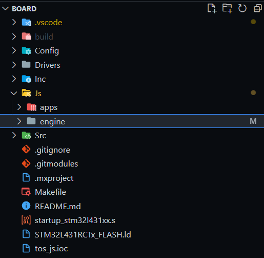
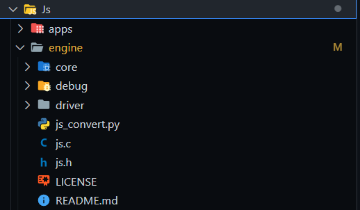
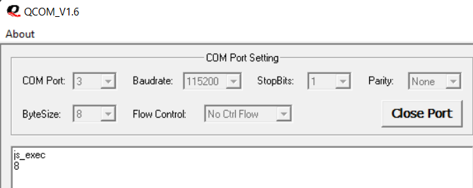

# TencentOS-tiny 项目1：JS 框架支持 by 田祥安

## 1. 项目地址

board目录下的工程文件: https://github.com/tommytim0515/tos_js (tos_js, GitHub)

JS引擎文件: https://github.com/tommytim0515/t_js (t_js, GitHub)

tos_js中的文件放在整个项目的board目录下，t_js是tos_js的一个submodule，位于board/Js/engine目录下，如下图所示：



采用submodule的模式是为了更加方便灵活地使用git管理变更。

## 2. 概述

t_js是一个用C语言实现的JS引擎，为了更轻量化，只实现了ES6功能实用的一部分，可以在微处理器上运行。它是基于开源项目Elk二次开发的，也继承了Elk的GNU General Public License v2.0协议。t_js在Elk的基础上进行了大规模重构，使得代码的模块更加清晰，利于维护。同时也修复了原代码中的若干缺陷。目前用户可以将写好的.js文件通过Python脚本转换成.h文件中的字符串来运行，后续将支持从SD卡读取和网络传输.js文件来运行。


## 3. 原理

t_js会将JavaScript代码解析成字符串的形式，进行解析并运行。用户申明指定大小的mem (char array)来作为运行内存 (目前的实现是在堆栈上，后续计划支持动态内存)。

以下是JS引擎的主要结构体：

```C
// JS engine (opaque)
typedef struct js_struct
{
    const char *code; // 正在解析的代码片段
    char errmsg[36];  // 错误消息块
    uint8_t tok;      // 前一个解析的符号的值
    uint8_t flags;    // 执行阶段标注，分为F_NOEXEC, F_LOOP, F_CALL, F_BREAK, F_RETURN
    uint16_t lev;     // 遍历深度
    jsoff_t clen;     // 代码片段的长度
    jsoff_t pos;      // 已经解析的代码的位置
    jsoff_t toff;     // 前一个解析的符号的offset
    jsoff_t tlen;     // 前一个解析的符号的长度
    jsval_t tval;     // 前一个解析的数值或字符串的值
    jsval_t scope;    // 现在所处的scope
    uint8_t *mem;     // 用户分配的内存
    jsoff_t size;     // 内存大小(存储实体的大小)
    jsoff_t brk;      // 已使用内存的标注
    jsoff_t ncbs;     // 导入的C函数的指针个数
} JS;
```

JS引擎会将代码的内容解析成一个个实体，从头开始存入内存。实体分为object，property和string类型。brk标注了使用内存 (实体存储) 的大小。JS引擎还可以通过语言交互接口 (Foreign Function Interface, FFI) 来导入C函数，函数指针将存到内存尾部的Callbacks部分，用size标注。每次执行完后，GC会先标注所有的实体，然后去掉使用中的实体的标注，最后进行垃圾回收。


## 4. 使用

### 配置步骤

在board文件目录创建Js文件夹，并在Js目录创建engine和apps文件夹，分别用于存放JS引擎和JavaScript脚本。然后将t_js项目的文件拷贝或克隆到engine目录。



在Makefile添加相应内容：
   
```makefile
JS_SRC = \
${wildcard Js/engine/core/*.c} \
${wildcard Js/engine/driver/*.c} \
${wildcard Js/engine/debug/*.c} \
${wildcard Js/engine/*.c}
C_SOURCES += $(JS_SRC)
```

```makefile
JS_INC = \
-IJs/engine \
-IJs/engine/core/include \
-IJs/engine/debug \
-IJs/engine/driver \
-IJs/apps/headers
C_INCLUDES += $(JS_INC)
```

如果有个性化配置，可以编写一个配置文件，如js_config.h：
   
```c
#pragma once
// FFI C 函数最大的传参数
#define JS_CFG_MAX_FFI_ARGS 6u
// 表达式的最大token数
#define JS_CFG_EXPR_MAX 20u
// 数值保存为32bit
#define JS_CFG_32_BIT 0u
// JS引擎内存大小
#define JS_CFG_MEM_SIZE 1024u
```

然后将配置文件也添加到makefile

最后，在需要编写JS相关代码的地方添加头文件js.h

### 使用说明

支持的语法：
1. 运算符：除了 !=, ==, (使用!==, ===), a ? b : c, a\[b\] 的所有JS标准运算符
2. 查询变量类型：typeof(a)
3. 循环：while(...) { ... }
4. 条件： if (...) { ... } else { ... }
5. 简单的变量类型：let a = 1, b, c = 2.3, d = 'a', e = null, f = true, g = false，暂不支持 var，const
6. 函数申明：let f = function(a, b) { return a + b; }，暂不支持 =>
7. 对象：let obj = {f: function(x) {return x * 2}}; obj.f(2); 
8. 每个语句都有一个分号 ; 结束
9. 字符串不支持unicode
10. 暂不支持数组、闭包、原型
11. 暂不支持 this， new，delete等关键字
12. 不支持标准库

用户可以使用如下函数：

```C
// 创建新的JS实例，并申明内存
JS *js_create(void *buf, size_t len);
// 使用预先申明好的静态内存创建新的JS实例
JS *js_create_static(); 
// 将JS执行结果转换成字符串的形式返回        
const char *js_str(JS *, jsval_t val);  
// 执行JS脚本
jsval_t js_eval(JS *, const char *, size_t);  
// 获取JS全局对象
jsval_t js_glob(JS *);  
// 创建新的对象
jsval_t js_mkobj(JS *);   
// 导入本地函数 (C 函数)
jsval_t js_import(JS *, uintptr_t, const char *);
// 设置对象属性
void js_set(JS *, jsval_t, const char *, jsval_t); 
// 查询JS内存使用量
int js_usage(JS *);               
// 读取JS文件并执行
jsval_t js_execute_script(JS *js, const char *filename); 
// 初始化JS驱动(导入C函数)
void js_driver_init(JS *js);
```

### 具体步骤

首先声明一块静态内存并创建一个JS实例：

```C
char mem[400];
JS *js = js_create(mem, sizeof(mem));
```

也可以使用默认的静态内存：

```C
JS *js = js_create_static();
```

如果有导入C函数(外部函数接口)，可以使用js_driver_init()初始化：

```C
js_driver_init(js);
```

执行JavaScript脚本，可以将执行结果用变量存储起来：

```C
jsval_t val = js_eval(js, "1 + 2 * 3.5", ~0);
```

可以通过js_str()将执行结果转换成字符串：

```C
printf("result: %s\n", js_str(js, val));
```

得到结果:

```bash
result: 8
```

### C函数调用

t_js支持通过语言交互接口(FFI)来调用C函数，可以通过js_import()来导入C函数。

例如下面这个C函数：

```C
void toggle_led()
{
    HAL_GPIO_TogglePin(GPIOB, GPIO_PIN_5);
}
```

可以通过如下方式进行导入：

```C
js_import(js, (uintptr_t)toggle_led, "v");
```

js为JS实例，(uintptr_t)toggle_led为导入的函数的地址，"v"函数的签名指示符。

函数签名指示符如下：

- b: 布尔类型
- d: double 类型
- i: 整型，包括char, short, int, long
- s: C字符串类型
- j：jsval_t类型
- m：现有的JS对象
- p：指针类型
- v：只适用于返回值，返回值为void

double作为入参时只能在前两位，float无法作为入参，需要转化成double。

将C函数导入global namespace，可以作为全局的函数来进行调用：

```C
// 获取全局对象
jsval_t glb = js_glob(js);
// 导入C函数并返回导入后的在JS内存的地址
jsval_t func_addr = js_import(js, (uintptr_t)toggle_led, "v");
// 将函数导入global namespace
js_set(js, glb, "toggle_led", func_addr);
```

之后便可以在JS脚本中通过toggle_led()来调用相应的C函数。

可以创建一个对象，将函数作为该对象的方法：

```C
jsval_t printer_obj = js_mkobj(js);
js_set(js, js_glob(js), "printer", printer_obj);

js_set(js, printer_obj, "print", js_import(js, (uintptr_t)print, "v"));
```

这样便可以在JS脚本中通过printer.print()来调用相应的C函数。

在t_js中，建议在Js/engine/driver/js_driver.c中编写C函数的导入和对象的申明，这样在使用的时候，调用js_driver_init()便可以进行初始化，如下面的示例：

```C
// js_driver.c
#include <stdio.h>
#include "js_driver.h"
#include "gpio.h"

void print(int num)
{
    printf("%d\n", num);
}

void toggle_led()
{
    HAL_GPIO_TogglePin(LED_GPIO_Port, LED_Pin);
}

void set_led(bool is_on)
{
    if (is_on)
        HAL_GPIO_WritePin(LED_GPIO_Port, LED_Pin, GPIO_PIN_SET);
    else
        HAL_GPIO_WritePin(LED_GPIO_Port, LED_Pin, GPIO_PIN_RESET);
}

void delay(int num)
{
    HAL_Delay(num);
}

void js_driver_init(JS *js)
{
    js_set(js, js_glob(js), "print", js_import(js, (uintptr_t) print, "vi"));
    js_set(js, js_glob(js), "toggle_led", js_import(js, (uintptr_t) toggle_led, "v"));
    js_set(js, js_glob(js), "set_led", js_import(js, (uintptr_t) set_led, "vb"));
    js_set(js, js_glob(js), "delay", js_import(js, (uintptr_t) delay, "vi"));
}
```

### 编写JS脚本并运行

用户可以直接将JS脚本以字符串的形式传给js_eval()来运行：

```C
js_eval(js, "let a = 0;"
            "while (a < 100) {"
            "   print(a);"
            "   a++;"
            "}",
            ~0);
```

也可以编写.js文件，并放入Js/apps目录下，然后运行Js/engine/js_convert.py脚本，将.js文件中的内容转化成相应的.h头文件。

例如loop.js:

```js
let a = 0;
while (a < 100){
    delay(100);
    print(a);
    a++;
}
```

经转换后会得到 js_app_loop.h:

```C
#pragma once

const char js_app_loop[] = "let a = 0; while (a < 100) {     delay(200);     print(a);     a++; }";
```

在需要使用的文件中导入js_apps.h，然后调用js_eval()即可执行：

```C
js_eval(js, js_app_loop, ~0);
```

## 4. 测试

使用小熊派(STM32L431RCT6, 详细硬件表述可以在[这里](https://bbs.huaweicloud.com/forum/thread-26424-1-1.html)获得)，GNU Arm Embedded 工具链(8-2018-q4-major)编译项目进行测试。

创建一个TencentOS-tiny的task来运行JS的任务：

```C
k_mutex_t mutex_js_engine;

k_task_t k_js_exec;
uint8_t stk_js_exec[TASK_SIZE_JS_EXEC];
void task_js_exec(void *pdata)
{
    printf("js_exec\n");
    k_err_t err = tos_mutex_pend(&mutex_js_engine);
    if (err == K_ERR_NONE)
    {
        JS *js = js_create_static();
        js_driver_init(js);
        js_eval(js, js_app_led_control, ~0);
        tos_mutex_post(&mutex_js_engine);
    }
    tos_sleep_ms(500);
}
```

### 测试1: calculation.js

js文件：

```js
let a = 1 + 2 * 3.5;
print(a);
```

TencentOS-tiny task:

```C
void task_js_exec(void *pdata)
{
    printf("js_exec\n");
    HAL_GPIO_TogglePin(LED_GPIO_Port, LED_Pin);
    k_err_t err = tos_mutex_pend(&mutex_js_engine);
    if (err == K_ERR_NONE)
    {
        JS *js = js_create_static();
        js_driver_init(js);
        js_eval(js, js_app_calculation, ~0);
        tos_mutex_post(&mutex_js_engine);
    }
    tos_sleep_ms(500);
}
```

执行结果:



### 测试2：loop.js

js文件：

```js
let a = 0;
while (a < 100) {
    delay(200);
    print(a);
    a++;
}
```

TencentOS-tiny task:

```C
void task_js_exec(void *pdata)
{
    printf("js_exec\n");
    HAL_GPIO_TogglePin(LED_GPIO_Port, LED_Pin);
    k_err_t err = tos_mutex_pend(&mutex_js_engine);
    if (err == K_ERR_NONE)
    {
        JS *js = js_create_static();
        js_driver_init(js);
        js_eval(js, js_app_loop, ~0);
        tos_mutex_post(&mutex_js_engine);
    }
    tos_sleep_ms(500);
}
```

执行结果:


### 测试3: led_control.js

js文件：

```js
let time = 2000;

print(time);

while (true) {
    toggle_led();
    delay(time);
}
```

TencentOS-tiny task:

```C
void task_js_exec(void *pdata)
{
    printf("js_exec\n");
    HAL_GPIO_TogglePin(LED_GPIO_Port, LED_Pin);
    k_err_t err = tos_mutex_pend(&mutex_js_engine);
    if (err == K_ERR_NONE)
    {
        JS *js = js_create_static();
        js_driver_init(js);
        js_eval(js, js_app_led_control, ~0);
        tos_mutex_post(&mutex_js_engine);
    }
    tos_sleep_ms(500);
}
```

执行结果:


## 5. 参考项目

1. Espruino is a single chip development board, billed as JavaScript for Microcontrollers. It runs the open source Espruino JavaScript engine, which supports a subset of the JavaScript standard.[Official website: https://www.espruino.com/, GitHub: https://github.com/espruino/Espruino]
   
2. Tessel brings integrated Wi-Fi to a JavaScript-focused microcontroller solution. Tessel provides a node.js compatible API, easing adoption for node.js developers. Tessel translates JavaScript to Lua (another scripting language) to execute. The translation implements a subset of the JavaScript standard. [Official website: https://tessel.io/, GitHub: https://github.com/tessel]

3. Kinoma Create from Marvell Semiconductor is a "JavaScript powered Internet of Things construction kit" running Marvell Semiconductor's XS JavaScript engine, which supports the full JavaScript 5th Edition standard. [GitHub: https://github.com/Kinoma]
   
4. ELK. A tiny JS engine for embedded systems that implements a small but usable subset of ES6. It is designed for microcontroller development. Instead of writing firmware code in C/C++, ELK allows development in JS. Another use case is providing customers with a secure, protected scripting environment for product customization. [GitHub: https://github.com/cesanta/elk]
