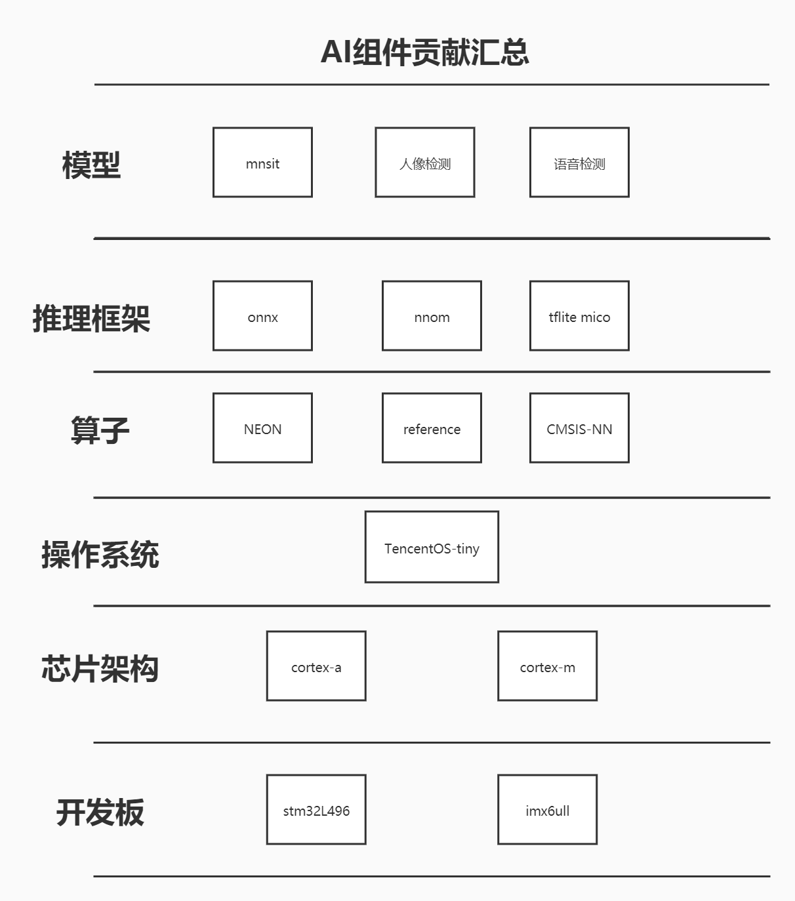
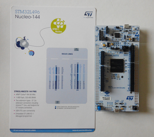
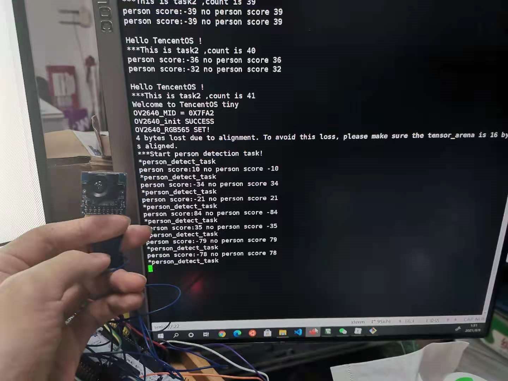
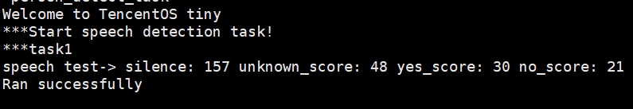
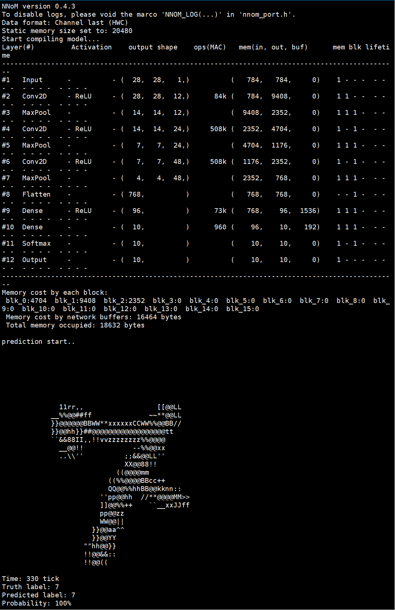
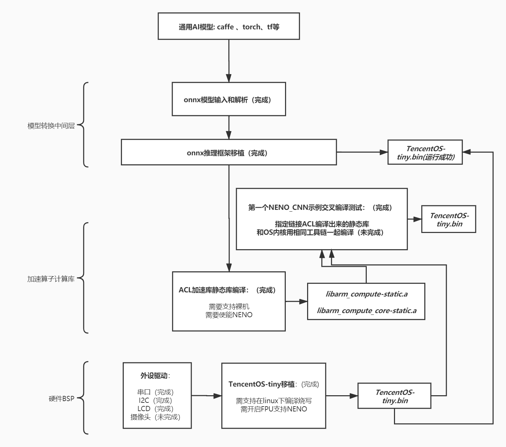
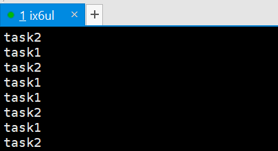

# TencentOS-tiny 项目3：TencentOS Tiny 物联网操作系统 AI组件开发 

## 贡献情况

### 软件包贡献

**软件包说明文档**在目录：***AI软件包*** 下分别各自的readme中

- tflite micro软件包

- onnx软件包
- nnom软件包

### 示例贡献

- stm32L496的行人检测和语音检测示例

- imx6ull的手写数字识别示例

- stm32L496的手写数字识别示例

**实例工程整理如下：**

https://gitee.com/dkk0918/tencent-os-tiny-ai-pack

## 过程及结果展示：

### 开发板选用

**stm32L496** （80MHz / 320kb RAM / ）

**imx6ull** (496MHz / 512Mb DDR / )

### 基于tflite的人像检测-stm32（识别镜头前有没有人）

示例位置：*\TencentOS-tiny\board\NUCLEO_STM32L496ZG\KEIL\tflitemicro_person_detection*

可以打印出摄像头前“有人”和“无人”的概率分数，倘若有人的概率居多则红灯闪烁

**内存占用116kb，推理速度0.6s一帧**

### 基于tflite的语音关键测检测-stm32（识别yes or ok）

示例位置：*\TencentOS-tiny\board\NUCLEO_STM32L496ZG\KEIL\tflitemicro_speech_detection*

素材来自的是使用谷歌的转换工具，将三段.wav格式的音频转换为离散数字音频，识别出里面的关键字yes、no或静默

**内存占用20kb，推理速度极快（忽略不计）**

### 基于nnom的手写数字识别-stm32（识别字符画对应的数字）

示例位置：*\TencentOS-tiny\board\NUCLEO_STM32L496ZG\KEIL\nnom_mnist*

示例来自mnist数据集图片（10张），模型由原nnom作者提供的keras例程训练转化为头文件

**内存占用18kb，推理速度0.3s，若替换为cmsis-nn算子，推理速度可以达到0.1s**

### 基于onnx的改良版手写数字识别-imx6ull（识别字符画对应的数字）

bsp位置：*\TencentOS-tiny\board\ALPHA_I.MX_emmc_256ddr*

ps:由于imx6ull工程的目录结构比较特殊，一时不确定该如何添加示例文件

本意是在内存和主频都更高的A核处理器上，做一套基于rtos的完整推理方案，但底层加速算子部分并未完成

**0.准备工作**

**TencentOS-Tiny在imx6ull上的启动方式修改**

参考程序是通过直接烧录进SD卡启动的，调试效率太低，因此改用uboot烧写编译出来的bin文件到另一个地址（考虑：90000000）。

uboot烧录操作如下：

1. 修改arch/arm/arm-v7a/lds/link.lds中的链接地址为0x90000000（这里做的不太好，因为这个地址其实是和具体板子的ddr大小耦合的，比如我的是512mb的ddr，但如果是其它小内存的arm-v7a架构的板子，就不能用这个地址了）

2. 烧录正点原子官方uboot进SD卡，设置波特率为115200并启动

3. 在uboot等待跳转时按下enter，输入：setenv bootcmd "dhcp 0x90000000 192.168.1.101:TencentOS-tiny.bin;dcache flush;go 0x90000000"，并输入saveenv保存，其中192.168.1.101是电脑主机的ip地址，这里的go地址一定要和链接脚本里的地址一致

4. 在电脑主机（windows）上安装Tftpd64软件，在settings里面设置默认tftp文件路径为tencentos-tiny工程路径，ip地址修改为本机ip，注意此软件必须要打开才可以进行tftp功能，ip地址也可以使用默认的127.0.0.1，但速度会慢很多，还是最好修改为本机ip

5. 在另一台电脑主机（linux）上配置Tftp服务器，我的做法是新建/etc/xinted.d/tftp文件并且输入配置信息（网上参考很多），然后重新启动tftp服务，注意要修改/etc/default/tftpd-hpa里面的烧录目标文件夹路径，并且chmod 777 Tftpboot 提升权限。

6. 重启开发板，可以看到示例的task打印程序在imx6ull上正常运行

   

   磨刀不误砍柴工，这个地方其实折腾了挺久，包括编译工具链的选择也是很头秃的事情，但后期调试的速度得到了大幅提升。

**1.移植一个AI推理框架，可以解析深度学习模型并且组合算子进行推理**（已完成onnx框架的移植）

​	对于cortex-a来说，基于Linux的有很多，比如腾讯自己的ncnn就很棒，包括谷歌的tencenflow lite，这两个是目前cortex-a系列的安卓机普遍采用的推理框架，但是问题就是他们必须依赖于linux内核提供的系统api以及一些计算库（比如numpy），移植到rtos上会非常困难，所以选择一些与OS耦合并不紧密的轻型推理框架进行移植，比如：onnx ， tensorflow lite micro，Tengine等。之前已经完成了tflite的移植，所以这次选择onnx进行移植。

​    但在使用浮点数推理的时候发现一个问题，如果在全局变量static const去定义大量的浮点数，然后在函数中调用会发生指令错误，这很可能是os在imx6ull平台上没有开启浮点支持，但若我开启fpu支持，在该工具链下的线程切换又会出问题，所以索性做一版支持整型推理的onnx推理框架。

​	移植步骤如下：

**实现 onnx 的内存管理部分**

内存管理实现部分在components/ai/onnx/platform/imx6ull/tencentos_libc_malloc.c，其实里面就是重新实现一下onnx用到的malloc、realloc、calloc、free这些系统api，转化为tencentos-tiny的tos_mmheap_xxx。

**修改 onnx 的浮点数推理为整型推理**

这部分是写了一个test.cpp的小工具来批量处理原本模型文件中的权重值，分别做了乘1000和乘1w的版本，将原本的double双精度小数转化为近似的整型数。

**制作 onnx 的整型数据图像**

与上面的方法类似，将示例图片也转换为整型数。

**修正 softmax 层的分类算法**

将softmax的上一层：dense2层的数据取出以后，发现整型数推理后的分布和浮点数的推理结果相反，并且无法使用数学库的expf函数，对于e的n次方使用整型数逼近拟合的方式求解（1+exp(n)）的八次方，但发现效果并不好，因为对于指数底的函数，动辄数值为几千的参数和原本归一化为-0.1~+0.1的参数之间的误差极大，所以不能使用指数底函数，索性使用sum / abs（n）来同样反应参数权重，最后的效果还行。

**神经网络逐层调通数据传递**

这是一个细致且耗时间的工作，因为需要逐层消除float为int，但又不是所有的地方都可以一键替换，所以要逐层修改并测试该层的输入输出是否正常。

**测试结果**

**2.移植一个可以在cortex-A上加速推理的库**（已完成ACL库的制作，但用makefile和OS链接还存在问题）

ARM-NN是一个知名的cortex-A的SDK，应用在很多安卓手机上，但与Linux耦合太紧，对于rtos不能直接用，所以选取了它底层的ACL加速库作为移植对象，可以完成硬浮点的neon加速，这个过程的坑可以说是非常多的...只能说这是目前暂时最好的选择

**下面这一段是我中期的时候写的：（感觉快被它逼疯了...）**

1.**试用。**首先本着先试用的原则，我在台式机linux上交叉编译后在运行linux系统的树莓派上测试，这里就有坑！官方使用的scons工具链，后面跟了一堆参数（十几个到二十几个不等），首先是工具链版本必须要6.3以上的gcc/g++，然后官方并没有一个写的很明白的参数手册，只有寥寥几个例子（其中参数引用还有错），摸索后使用ACL在树莓派（linux）上成功跑了一个alexnet分类模型。

2.**裸机库编译。**下一步是编译裸机模式下的库，不出意外的是按照官方流程编译又失败了（我感觉ARM就没把裸机当回事，可能没人会想着在A核上搞裸机），然后跟其中的一位维护者往来几封email，外加试了一堆堆参数，成功编译了裸机模式的ACL静态库！

3.**示例编译。**由于官方连个API手册都没有，以至于我需要通过去学习它的示例，才知道该如何写自己的代码。但是呢，它的example=1选项根本不支持arm-v7a（这也是一个bug，维护者还感谢我的发现，说以后这里要禁止v7a编译示例，我晕）。所以没办法了，我决定找一个最简单的NENO_CNN.cpp，把它作为TencentOS-Tiny的一个驱动来编译，缺什么我就补什么文件进来。这是一个重要的基础，只要能够成功编译一个示例，那么就说明我掌握了正确使用NENO加速算子的方法，那么就可以去写ACL算子和后端推理框架的兼容层了，这是一件很有意义的事情！

想想很美好，但在3中我还未成功编译这个最简单的示例，因为ACL库实在太大了依赖众多，上百个错误得一个一个解决，外加我对makefile和scons其实不是那么熟悉，也是边学边弄，统一操作系统的编译器和ACL的编译器也是个难题，试了很多目前选用的是arm-linux-gnueabihf-gcc/g++的7.5版本，主要ACL库太吃编译器了。。。希望自己再熬几天就能解决此问题。

**中期之后解决了以上的很多问题：（对关键点进行记录）**

以下是无数次试错(试了十几种不同的工具链)，和尝试众多编译后缀参数，与ARM官方巨慢的邮件往来，摸索出来的ACL在裸机上编译的正确方法，应该是全网唯一，贴结论如下：

- 可以用的工具链选择

6.3以上的arm-linux--gnueabihf-xxx（对于ACL源码基本无需修正）

7.3以上的arm-none-gcc-xxx （需要做ACL源码一些修正，删除一些会引起报错但又不必要的头文件，修改编译参数）

- 编译ACL库生成静态.a库

以上两种编译器分别对应ComputeLibrary和ComputeLibrary_none两个版本

编译命令：

***scons arch=armv7a os=bare_metal build_dir=bm -j8 Werror=1 opencl=0 neon=1 debug=0 asserts=1 standalone=1 validation_tests=1 examples=1 openmp=0 cppthreads=0***

- 编译示例的卷积网络

对于arm-linux-gnueabihf-xxx的编译命令：

***arm-linux-gnueabihf-g++ examples/neon_convolution.cpp utils/Utils.cpp -I. -Iinclude -std=c++14 -larm_compute-static -larm_compute_core-static -Lbuild/bm -L. build/bm/libarm_compute-static.a build/bm/libarm_compute_core-static.a -march=armv7-a -mfpu=neon -mfloat-abi=hard***

对于arm-none-gcc-xxx

***arm-none-eabi-g++ examples/neon_convolution.cpp utils/Utils.cpp -I. -Iinclude -std=c++14 -larm_compute-static -larm_compute_core-static -Lbuild/bm -L. build/bm/libarm_compute-static.a build/bm/libarm_compute_core-static.a -static-libstdc++ --specs=nosys.specs -march=armv7-a -mfpu=neon -mfloat-abi=hard***

- makefile实现 C 和 C++的混编并链接静态库

参考我放在仓库里的/back/makefile，可以实现C++的编译和静态库的链接，但是C对C++的链接似乎还有些问题待解决

## 参考

https://github.com/Tencent/TencentOS-tiny/tree/master/board/ALPHA_I.MX_emmc_256ddr

原仓库的驱动程序基本是移植正点原本为数不多的裸机驱动开发，完成OS内核的基本移植。

https://github.com/Derekduke/tencentos-tiny-with-tflitemicro-and-iot

这个是我自己的github仓库之前为TencentOS-tiny提交过的AI/tflilte组件以及示例，替换了原本框架就支持的cmsis-nn算子，可以运行谷歌自带的人像检测模型。

https://github.com/ARM-software/ComputeLibrary

ARM支持cortex-a的计算库，对于安卓和Linux支持比较完善，对于裸机的提及非常少而且坑很多。

https://github.com/wuhanstudio/onnx-backend

这是一位RT-Thread深度贡献者为RT做的onnx推理包，是基于未量化的权重和浮点数做的推理。

https://github.com/majianjia/nnom

一个适用于微处理器的轻量级推理框架，接口友好

## 总结

### 完成情况总结

在cortex-m上的完成度还算不错，软件包均配套完整的示例，由于手上缺少麦克风，所以在tflite上仅实现语音唤醒词对示例的推理，而未实现真实语音处理，而且nnom的语音demo也未能演示，此外tengine lite也有语音的比较完整demo，看来后期需要实现声音采集。此外，若能实现文件系统和交互性不错的shell，便可以实现模型的命令行加载，演示和调试效果更佳。

在cortex-a上的困难较多，仅完成了onnx的移植，并且修改了模型和推理算子才能跑起来，操作系统和工具链的支持并不完善，比如：浮点数不支持就让很多demo和推理框架跑不了，需要在后期解决cortex-a的浮点数支持，以及更多编译器的支持。

其中ACL库的试错占用了很多时间，从编译一堆报错到可以生成静态库，并且单独交叉编译示例的CNN例程是可以通过的，但和OS链接暂未解决，ACL库可以实现在cortex-a底层算子的neon加速并提供接口，是后续能运行复杂模型需要的支持。

总体时间比较紧，完成了多种推理框架的移植，并试验了较为基础的模型，对于更为复杂的模型或者外设配合的演示demo未能做的更多，希望后续可以在此基础之上持续贡献。

### 思考

本课题的要求是对AI部分做一个开放性的提升，我个人认为对于一个操作系统，AI相关内容的移植主要分为：**模型、推理框架、算子**这三大部分可以去提升OS对于AI的兼容性。这其中tencentos-tiny的第一个AI demo是基于cortex-m架构去使用cmsis-nn算子，移植tflite micro框架，使用了一个INT8的量化模型，可以说是对于cortex-m去做的定制化AI示例。那么要想让丰富AI模型可以在多平台的使用，依赖于和目标平台高耦合度的算子，比如M核对应cmsis-nn，A核对应neon或者是一些其它异构平台等等。但是组合算子的推理框架是可以同一框架在多平台使用的（只要算子种类支持），而且目前支持rtos的推理框架并不少，但各个推理框架可以兼容或解析的模型格式并不同。所以如果希望TencentOS可以加载多个不同种类的模型，比如：caffe、tf、torch等，需要找一个推理框架使用一种可以被多种模型文件转换的通用格式（比如：onnx模型格式），同时又有一套强大的推理算子库（在什么平台就使用什么算子），这是一个提升AIOT生态的方法，做模型的人不用考虑算法如何部署，而做部署的人不用考虑是什么模型。所这次是在有限的时间里去做一个尝试，尝试在一个新平台（cortex-a）上做一个算子加速方案，移植新的推理框架，然后做示例去运行一些简单模型，这个雏形形成以后，后面再逐渐丰富更多的算子、更多的平台、更多的模型。